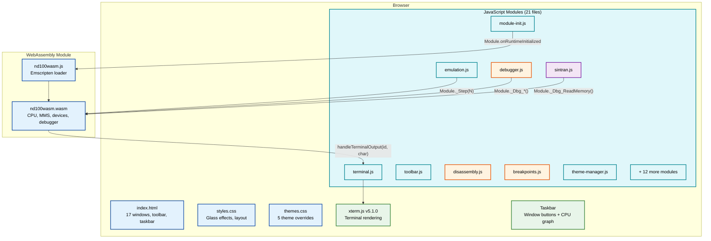
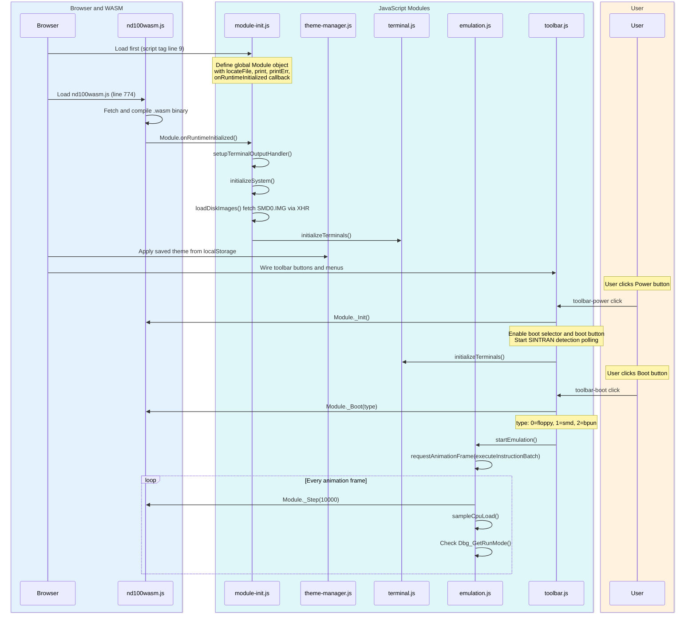
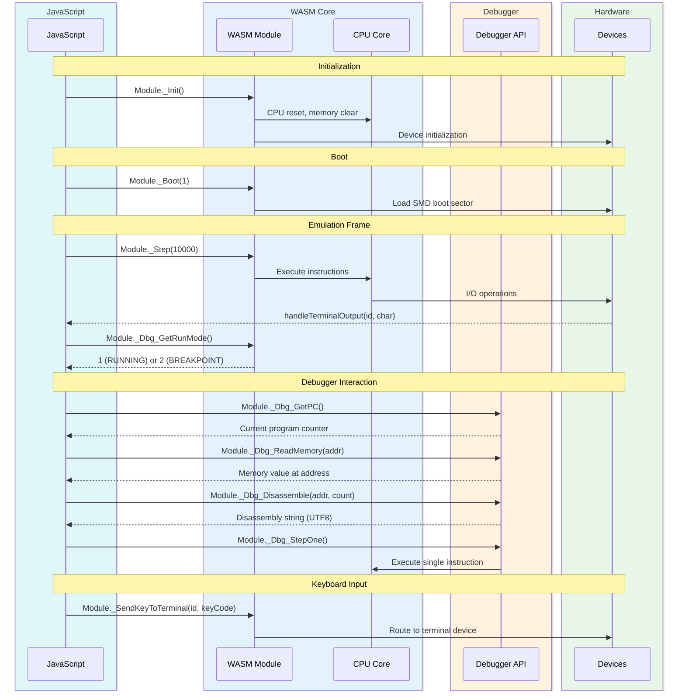

# Glass UI Architecture Reference

Comprehensive architecture documentation for the ND100X glassmorphism browser frontend (`template-glass/`).

> **Target audience**: Contributors modifying or extending the Glass UI.
> **Build & run**: `make wasm-glass` to build, `make wasm-glass-run` to build and serve on `localhost:8000`.

---

## Table of Contents

1. [Introduction](#introduction)
2. [Architecture Overview](#architecture-overview)
3. [Build Pipeline](#build-pipeline)
4. [Boot Sequence](#boot-sequence)
5. [Emulation Loop](#emulation-loop)
6. [Window Management](#window-management)
7. [Module Reference](#module-reference)
8. [Toolbar & Menus](#toolbar--menus)
9. [Terminal Integration](#terminal-integration)
10. [Debugger](#debugger)
11. [SINTRAN OS Detection & Inspectors](#sintran-os-detection--inspectors)
12. [Theme System](#theme-system)
13. [Data Flow: C to JS](#data-flow-c-to-js)
14. [CSS Architecture](#css-architecture)
15. [State Persistence](#state-persistence)
16. [Adding a New Window](#adding-a-new-window)

---

## Introduction

The Glass UI is the primary browser frontend for the ND100X emulator. It provides a modern glassmorphism interface with:

- Draggable, resizable floating windows
- xterm.js VT100 terminal emulation
- Full CPU debugger (registers, memory, disassembly, breakpoints, watchpoints)
- SINTRAN III operating system introspection tools
- 5 switchable color themes
- CPU load graphing with 60-second scrolling history
- Hardware page table inspector

The UI runs entirely in the browser. The emulator core is compiled to WebAssembly via Emscripten, and all debugger/inspector functionality calls exported C functions through the WASM bridge.

---

## Architecture Overview



---

## Build Pipeline

`make wasm-glass` performs the following steps:

1. **Emscripten compile**: `emcmake cmake` builds the C codebase into `build_wasm_glass/bin/nd100wasm.js` + `nd100wasm.wasm` with `DEBUGGER_ENABLED=ON` and 74 exported `Dbg_*` functions.
2. **Copy UI assets**: The Makefile copies the entire `template-glass/` tree into `build_wasm_glass/bin/`:
   - `index.html` (entry point)
   - `css/styles.css`, `css/themes.css`
   - `js/*.js` (21 modules)
   - `data/logical-device-numbers.json`
3. **Serve** (optional): `make wasm-glass-run` starts `python3 -m http.server 8000` in the build output directory.

The WASM binary and the UI assets are combined at build time, not at runtime. The browser loads `index.html` which references all JS/CSS files and the Emscripten-generated `nd100wasm.js` loader.

**Exported WASM functions** are defined in `src/frontend/nd100wasm/CMakeLists.txt` via the `EXPORTED_FUNCTIONS` linker flag. `UTF8ToString` is included in `EXPORTED_RUNTIME_METHODS` for C string returns.

---

## Boot Sequence



### Script Load Order

Scripts load in this exact order (from `index.html`):

| Order | File | Purpose |
|-------|------|---------|
| 1 | `js/module-init.js` | Global `Module` object, disk loading, terminal output handler |
| 2 | xterm.js (CDN) | Terminal rendering library |
| 3 | xterm-addon-fit (CDN) | Terminal auto-fit addon |
| 4 | `nd100wasm.js` | Emscripten-generated WASM loader |
| 5 | `js/theme-manager.js` | Theme load/save/apply |
| 6 | `js/terminal.js` | xterm.js terminal creation and keyboard input |
| 7 | `js/emulation.js` | Main execution loop, CPU load sampling |
| 8 | `js/toolbar.js` | Window management, buttons, menus, dragging |
| 9 | `js/floppy-browser.js` | Floppy image library browser |
| 10 | `js/help-window.js` | SINTRAN command help with search |
| 11 | `js/debugger.js` | Debugger panel (registers, memory, flags, stepping) |
| 12 | `js/disassembly.js` | Standalone disassembly window |
| 13 | `js/breakpoints.js` | Breakpoint/watchpoint manager |
| 14 | `js/sintran.js` | OS detection polling and system info |
| 15 | `js/sintran-symbols.js` | Shared symbol tables and memory helpers |
| 16 | `js/sintran-rt-names.js` | RT program name reverse lookup |
| 17 | `js/sintran-processes.js` | Process list and detail windows |
| 18 | `js/sintran-queues.js` | Execution, time, monitor queue viewer |
| 19 | `js/sintran-seg-names.js` | System segment name lookup |
| 20 | `js/sintran-segments.js` | Segment table viewer |
| 21 | `js/sintran-dev-names.js` | Device address-to-name tables |
| 22 | `js/sintran-devices.js` | I/O device inspector (4-phase discovery) |
| 23 | `js/pagetables.js` | Hardware page table inspector |
| 24 | `js/cpu-load-graph.js` | CPU load graph (scrolling 60s history) |

### Two-Phase Init/Boot

`Init()` and `Boot()` are deliberately separated in the WASM API:

- **`Module._Init()`** - Hardware initialization only: CPU reset, memory clear, device setup. Called when the user clicks Power On.
- **`Module._Boot(type)`** - Load boot sector from virtual filesystem. Called when the user clicks Boot.

This separation allows the UI to configure settings (e.g., select boot device, load disk images) between hardware init and boot.

---

## Emulation Loop

The main emulation loop lives in `emulation.js` and uses `requestAnimationFrame` for smooth 60fps execution:

```
executeInstructionBatch()
  |
  +-- Guard: if (!emulationRunning && !continuousStepMode) return
  +-- Module._Step(10000)           // Execute 10,000 instructions
  +-- sampleCpuLoad()               // Sample PIL for CPU utilization
  +-- mode = Module._Dbg_GetRunMode()
  |     |
  |     +-- mode === 2 (CPU_BREAKPOINT):
  |     |     Stop emulation, show debugger, update status
  |     |
  |     +-- mode === 1 (CPU_RUNNING):
  |           requestAnimationFrame(executeInstructionBatch)
  |
  +-- Update CPU load graph
```

### Key Constants

| Constant | Value | Location |
|----------|-------|----------|
| `instructionsPerFrame` | 10,000 | `emulation.js:45` |
| `CPU_LOAD_WINDOW` | 120 samples | `emulation.js:56` |
| `CPU_LOAD_DOM_INTERVAL` | 15 frames | `emulation.js:57` |

### CPU Load Sampling

Every frame, `sampleCpuLoad()` reads the current interrupt level via `Module._Dbg_GetPIL()`. PIL 0 = idle, any other level = busy. Samples are stored in a ring buffer and averaged to produce a percentage. The load value drives both the CPU Load Graph window and the taskbar mini graph.

### Two Mutually Exclusive Loops

The Glass UI has two execution loops that must never run simultaneously:

1. **Main loop** (`emulation.js` - `executeInstructionBatch`): Runs 10K instructions per frame at 60fps. Used during normal emulation.
2. **Debugger loop** (`debugger.js` - `dbgExecutionFrame`): Used for step operations and debugger-controlled execution.

When the debugger takes control (step, breakpoint hit), the main loop is stopped. When the user clicks Run in the debugger, the main loop resumes.

### Breakpoint Detection

After each `_Step()` call, `Dbg_GetRunMode()` is checked:
- `2` (`CPU_BREAKPOINT`) - Execution breakpoint hit. Stop reason checked via `Dbg_GetStopReason()`: value `8` = data watchpoint, value `2` = execution breakpoint.
- The emulation loop stops, the debugger window opens, and the breakpoint/disassembly views refresh.

---

## Window Management

All floating windows in the Glass UI share the same structure and behavior.

### Window Structure

Each window is a `<div class="glass-window">` with `position: fixed`:

```html
<div id="example-window" class="glass-window" style="display: none;">
  <div class="glass-window-header" id="example-header">
    <span>Window Title</span>
    <button class="glass-close-btn" id="example-close">x</button>
  </div>
  <div class="glass-window-body">
    <!-- content -->
  </div>
  <div class="resize-handle"></div>  <!-- optional -->
</div>
```

### Dragging

`makeDraggable(win, header, storageKey)` in `toolbar.js` makes a window draggable:

- **mousedown** on header: Record offset between mouse position and window corner
- **mousemove**: Update `left`/`top` style, constrained to viewport (min: `x=0, y=49` below toolbar; max: `innerWidth-100, innerHeight-60`)
- **mouseup**: Save position to localStorage

### Resizing

`makeResizable(win, handle, storageKey, minW, minH)` in `toolbar.js`:

- Corner grip in the resize handle
- Enforces minimum dimensions
- Saves width/height to localStorage

### Window Manager

The `windowManager` object in `toolbar.js` coordinates z-ordering and the taskbar:

```
windowManager = {
  zCounter: 7000,        // Increments per focus, resets at 8899
  windows: {},           // {id: {name, element}}
  focusedId: null,       // Currently focused window

  register(id, name)     // Add window, set initial z-index
  focus(id)              // Bring to front, update taskbar highlight
  updateTaskbar()        // Rebuild taskbar buttons for visible windows
  updateTaskbarActive()  // Highlight the focused window's button
}
```

Z-index range: 7000-8899 for windows, 8999 for dropdown menus.

### Taskbar

The taskbar at the bottom of the screen shows buttons for all visible windows. It is rebuilt every 500ms by `updateTaskbar()`, which:

1. Scans all registered windows for `display !== 'none'`
2. Compares against the previous set (avoids DOM thrashing if unchanged)
3. Creates a button per visible window
4. Click on a button: ensures window is visible, moves it into viewport if off-screen, focuses it

The taskbar also contains the CPU load mini-graph canvas (80x24px) and a settings button.

### Window Inventory

| Window ID | Default | Purpose |
|-----------|---------|---------|
| `machine-window` | Visible | Machine info, floppy drive status |
| `cpu-load-window` | Hidden | CPU utilization graph (resizable) |
| `terminal-window` | Visible | VT100 terminal (maximizable) |
| `about-window` | Hidden | About dialog |
| `config-window` | Hidden | Theme selector |
| `floppy-modal` | Hidden | Floppy image library browser |
| `products-modal` | Hidden | Product filter for floppy browser |
| `help-window` | Hidden | SINTRAN command help (resizable) |
| `debugger-window` | Hidden | CPU debugger panel |
| `disasm-window` | Hidden | Standalone disassembly (resizable) |
| `breakpoints-window` | Hidden | Breakpoint/watchpoint manager (resizable) |
| `sysinfo-window` | Hidden | SINTRAN system information |
| `process-list-window` | Hidden | RT process list (resizable) |
| `queue-viewer-window` | Hidden | Queue viewer: exec/time/monitor (resizable) |
| `segment-table-window` | Hidden | Segment table viewer (resizable) |
| `io-devices-window` | Hidden | I/O device inspector (resizable) |
| `page-table-window` | Hidden | Hardware page table viewer (resizable) |

---

## Module Reference

| Module | File | Responsibility | Global API |
|--------|------|----------------|------------|
| Init | `module-init.js` | WASM `Module` object, disk loading, terminal output callback | `Module`, `terminals`, `loadDiskImage()`, `handleTerminalOutput()` |
| Theme | `theme-manager.js` | 5 themes, localStorage persistence | `window.setTheme()`, `window.getTheme()` |
| Terminal | `terminal.js` | xterm.js setup, keyboard input, font/color selection | `createTerminal()`, `sendKey()` |
| Emulation | `emulation.js` | Main execution loop, CPU load sampling, level bars | `startEmulation()`, `stopEmulation()`, `createLevelBars()` |
| Toolbar | `toolbar.js` | Window management, drag/resize, menus, power/boot buttons | `makeDraggable()`, `makeResizable()`, `windowManager` |
| Floppy Browser | `floppy-browser.js` | Floppy image library, search, product filter, mount | `openFloppyBrowser()`, `closeFloppyBrowser()` |
| Help | `help-window.js` | SINTRAN command help, search, section navigation | `openHelpWindow()`, `closeHelpWindow()` |
| Debugger | `debugger.js` | Register display, memory view, flags, step controls | `window.dbgShowWindow()`, `window.dbgHideWindow()`, `window.dbgActivateBreakpoint()` |
| Disassembly | `disassembly.js` | Standalone disassembly window with breakpoint gutters | `window.disasmShowWindow()`, `window.disasmHideWindow()` |
| Breakpoints | `breakpoints.js` | Breakpoint/watchpoint list, add/remove UI | `window.bpShowWindow()`, `window.bpHideWindow()`, `window.bpRefresh()` |
| SINTRAN Core | `sintran.js` | OS detection polling, SYSEVAL read, system info display | `sintranStartDetection()`, `sintranState` |
| SINTRAN Symbols | `sintran-symbols.js` | Shared addresses, structure offsets, memory read helpers | `window.sintranSymbols` |
| RT Names | `sintran-rt-names.js` | RT program address-to-name reverse lookup | `window.resolveProcessName()` |
| Processes | `sintran-processes.js` | RT description table viewer, process detail | (internal show/hide) |
| Queues | `sintran-queues.js` | Execution, time, monitor queue viewer (3 tabs) | (internal show/hide) |
| Segment Names | `sintran-seg-names.js` | System segment number-to-name lookup | `window.segmentNames` |
| Segments | `sintran-segments.js` | Segment table viewer with flags and cross-references | (internal show/hide) |
| Device Names | `sintran-dev-names.js` | I/O device address-to-symbol lookup (K03/L07/M06) | `window.deviceNames` |
| Devices | `sintran-devices.js` | I/O device inspector (4-phase discovery, tabbed) | (internal show/hide) |
| Page Tables | `pagetables.js` | Hardware PTE viewer with decoded flags | `window.pageTableShowWindow()`, `window.pageTableHideWindow()` |
| CPU Load Graph | `cpu-load-graph.js` | Scrolling 60s CPU load graph, taskbar mini graph | `window.cpuLoadGraphPush()`, `window.cpuLoadGraphReset()` |

---

## Toolbar & Menus

The toolbar is a sticky bar at the top of the viewport containing:

### Left Section
- ND100X logo and brand text

### Center Section - Dropdown Menus

**View Menu** (`menu-view`):
| Item | Action |
|------|--------|
| Machine Info | Toggle `machine-window` |
| CPU Load Graph | Toggle `cpu-load-window` |
| Floppy Library | Open floppy browser modal |
| Debugger | Toggle `debugger-window` via `dbgShowWindow()`/`dbgHideWindow()` |
| Disassembly | Toggle `disasm-window` via `disasmShowWindow()`/`disasmHideWindow()` |
| Breakpoints | Toggle `breakpoints-window` via `bpShowWindow()`/`bpHideWindow()` |
| Page Tables | Toggle `page-table-window` |

**SINTRAN Menu** (`sintran-menu-container`):
- Hidden by default, shown when SINTRAN is detected
- Items: System Info, Processes, Queues, Segments, I/O Devices

**Help Menu** (`menu-help`):
- SINTRAN Commands (opens help window)
- About (opens about window)

### Right Section

| Element | ID | Purpose |
|---------|----|---------|
| Status text | `status` | Shows "Ready", "Running", "Breakpoint hit", etc. |
| Power button | `toolbar-power` | Toggle power on/off (off reloads the page) |
| Boot type selector | `boot-select` | Dropdown: SMD, Floppy, BPUN |
| Boot button | `toolbar-boot` | Trigger boot with selected type |
| Reset button | `toolbar-reset` | Reset the emulator |

---

## Terminal Integration

### xterm.js Setup

The terminal uses xterm.js v5.1.0 loaded from CDN, with the fit addon for responsive sizing.

**Terminal creation** (`terminal.js` - `createTerminal()`):
- Creates a DOM container `terminal-container-{identCode}`
- Creates a tab button for multi-terminal switching
- Configures xterm.js with: `cursorBlink: true`, `rows: 24`, `cols: 80`
- Stores reference in global `terminals[identCode]` object

### Responsive Font Sizing

Font size is computed dynamically to fit 80x24 characters within the terminal container:
1. Measure actual character cell dimensions at reference size (16px)
2. Calculate maximum font size that fits 80 columns and 24 rows
3. Clamp between 10px and 24px

### Keyboard Input Flow

```
User keypress -> xterm.js onKey handler -> sendKey(keyCode)
  -> Module._SendKeyToTerminal(activeTerminalId, keyCode)
    -> C terminal device handler
```

Special handling:
- **Ctrl+A..Z**: Mapped to control codes 1-26
- **LF (10)**: Converted to CR (13)
- **Backspace (8/127)**: Echo `\b \b` locally

### Font & Color Options

Fonts (selectable via `#font-family-select`):
`monospace`, `VT323`, `Fira Mono`, `IBM Plex Mono`, `Cascadia Mono`, `Source Code Pro`

Color themes (selectable via `#color-theme-select`):

| Theme | Foreground | Background |
|-------|------------|------------|
| Green | `#00FF00` | transparent |
| Amber | `#FFBF00` | transparent |
| White | `#F8F8F8` | transparent |
| Blue | `#00BFFF` | transparent |
| Paperwhite | `#222222` | `#f0f0f5` |

Settings are persisted in localStorage key `terminal-settings`.

---

## Debugger

The debugger panel (`debugger.js`) provides full CPU inspection and control.

### Register Display

Registers shown: `STS`, `P` (PC), `A`, `D`, `B`, `L`, `T`, `X`, `EA`

Element IDs: `dbg-r-{sts,p,a,d,b,l,t,x,ea}`

- Values displayed in octal
- Click any register to edit inline (octal input, commit on Enter or blur)
- Changed values flash with highlight for 600ms

### Step Controls

| Button | ID | WASM Function | Description |
|--------|----|---------------|-------------|
| Step In | `dbg-step` | `_Dbg_StepOne` | Execute one instruction |
| Step x10 | `dbg-step10` | `_Dbg_StepOne` x10 | Execute 10 instructions (stops early on breakpoint) |
| Step Over | `dbg-step-over` | `_Dbg_StepOver` | Step over subroutine calls |
| Step Out | `dbg-step-out` | `_Dbg_StepOut` | Run until current subroutine returns |
| Run | `dbg-run` | `_Dbg_SetPaused(0)` | Resume continuous execution |
| Pause | `dbg-pause` | `_Dbg_SetPaused(1)` | Pause execution |

### Keyboard Shortcuts

| Key | Action |
|-----|--------|
| F5 | Run/Pause toggle |
| F9 | Toggle breakpoint at current PC |
| F10 | Step Over |
| F11 | Step In |
| Shift+F11 | Step Out |

### Auto-Refresh

When the debugger window is visible, a 250ms timer calls `refreshView()` which dispatches to the active tab's renderer (registers, memory, disassembly, flags).

### Status Bar

Element `dbg-status` shows `RUNNING`, `PAUSED`, or `IDLE` with corresponding CSS class for color.

---

## SINTRAN OS Detection & Inspectors

### Detection Mechanism

`sintran.js` polls for SINTRAN III after power-on:

1. **Start**: `sintranStartDetection()` called after `Module._Init()`, starts a 2-second interval
2. **Poll**: Each tick reads SINVER at address `0x82D` (octal `004055`) via `Module._Dbg_ReadMemory()`
3. **Validate**: Extract version letter from low 7 bits (must be ASCII A-Z, range `0x41-0x5A`)
4. **OS type**: Extract from bits 10-8 (fallback: bits 14-12). Values: 0=VS, 1=VSE, 2=VSE/500, 3=RTP, 4=VSX, 5=VSX/500
5. **On detection**: Stop polling, set `sintranState.detected = true`, show SINTRAN menu

### SYSEVAL Table

12 words at octal addresses `004051-004064`, stable across all SINTRAN versions:

| Symbol | Address | Content |
|--------|---------|---------|
| SYSNO | `0x829` | System number |
| HWINFO0 | `0x82A` | CPU type + instruction set |
| HWINFO1 | `0x82B` | Microprogram version |
| HWINFO2 | `0x82C` | System type |
| SINVER0 | `0x82D` | Version letter + OS type |
| REVLEV | `0x82F` | Revision level |
| GENDAT0-4 | `0x830-0x834` | Generation date (min/hr/day/mon/yr) |
| UNAFLAG | `0x847` | System availability |

### Kernel Data Access

All SINTRAN inspector windows access kernel data through **DPIT** (Alternative Page Table #7). This is critical because kernel data resides in a different address space than user programs. The debugger's `Dbg_ReadPhysicalMemory()` and `Dbg_GetPageTableEntryRaw()` functions bypass the normal page table to read kernel structures.

### Inspector Windows

**System Info** (`sysinfo-window`): Displays SYSEVAL data, OS version string, hardware info.

**Process List** (`sintran-processes.js`): Reads the RT-Description table (22 words per entry). Shows process number, name (via `resolveProcessName()`), status flags, priority, segment assignments. Filterable by status. Click to see detail view with saved registers.

**Queue Viewer** (`sintran-queues.js`): Three tabs:
- **Execution Queue**: Circular linked list via WLINK field, ordered by priority
- **Time Queue**: Linked via TLINK, shows remaining time ticks
- **Monitor Queue**: I/O datafield chain via MQUEU head pointer

**Segment Table** (`sintran-segments.js`): Reads SGMAX segments from physical memory at `(SEGTB << 16) + SEGST`. 8 words per entry. Shows segment name (from `sintran-seg-names.js`), flags, physical addresses, RT cross-references.

**I/O Device Inspector** (`sintran-devices.js`): 4-phase discovery:
1. Symbol enumeration from `sintran-dev-names.js` tables
2. BRESL chain walk (enriches existing entries only)
3. MQUEU chain walk (enriches existing entries only)
4. R/W pair merge and category classification via GDEVTY/TYPRI

Tabbed by device category. 4-level filter: All / Configured / Initialized (default) / Active.

### RT Program Name Resolution

Program names are NOT stored in SINTRAN memory. `sintran-rt-names.js` provides reverse lookup tables built from linker symbol tables (SYMBOL-2-LIST) for K03, L07, and M06 versions. Background programs (BAKnn/BCHnn) are computed from terminal number ranges.

---

## Theme System

### Available Themes

| Theme | `data-theme` | Background | Glass | Accent |
|-------|-------------|------------|-------|--------|
| Dark (default) | (none) | `#0a0c1a` gradient | `rgba(12,16,35,0.85)` | Cyan |
| Light | `light` | `#e8ecf4` | `rgba(255,255,255,0.75)` | Blue |
| Amber | `amber` | `#0a0800` | `rgba(20,16,5,0.9)` | Amber |
| Nord | `nord` | `#2e3440` | `rgba(46,52,64,0.88)` | Frost cyan |
| Synthwave | `synthwave` | Purple gradient | `rgba(26,10,46,0.88)` | Hot pink |

### How It Works

`theme-manager.js` manages themes via the `data-theme` attribute on `<body>`:

- **Dark theme**: No `data-theme` attribute (CSS defaults)
- **Other themes**: `document.body.setAttribute('data-theme', name)`
- **Persistence**: `localStorage.getItem/setItem('nd100x-theme')`
- **Config window**: 5 theme cards with swatch previews, active card highlighted

`themes.css` contains `body[data-theme="NAME"]` blocks that override CSS custom properties defined as defaults in `styles.css`.

---

## Data Flow: C to JS



### Key WASM Bridge Functions

| Category | Function | Returns |
|----------|----------|---------|
| **Lifecycle** | `_Init()` | void |
| | `_Boot(type)` | void |
| | `_Step(count)` | void |
| | `_IsInitialized()` | bool |
| **CPU State** | `_Dbg_GetRunMode()` | 0-5 (CPURunMode enum) |
| | `_Dbg_GetPC()` | 16-bit address |
| | `_Dbg_GetPIL()` | 0-15 (interrupt level) |
| | `_Dbg_GetStopReason()` | Stop reason code |
| **Registers** | `_Dbg_GetRegister(level, reg)` | 16-bit value |
| | `_Dbg_SetRegister(level, reg, val)` | void |
| | `_Dbg_GetPCR(level)` | Page Control Register |
| **Memory** | `_Dbg_ReadMemory(addr)` | 16-bit value |
| | `_Dbg_ReadPhysicalMemory(addr)` | 16-bit value |
| | `_Dbg_Disassemble(addr, count)` | char* (UTF8) |
| **Breakpoints** | `_Dbg_AddBreakpoint(addr)` | void |
| | `_Dbg_RemoveBreakpoint(addr)` | void |
| | `_Dbg_GetBreakpointList()` | char* (UTF8) |
| | `_Dbg_AddWatchpoint(addr, type)` | void |
| | `_Dbg_RemoveWatchpoint(addr)` | void |
| **Stepping** | `_Dbg_StepOne()` | void |
| | `_Dbg_StepOver()` | void |
| | `_Dbg_StepOut()` | void |
| | `_Dbg_SetPaused(flag)` | void |
| **Page Tables** | `_Dbg_GetPageTableEntryRaw(pt, vpn)` | 32-bit PTE |
| | `_Dbg_GetPageTableCount()` | count |
| | `_Dbg_GetExtendedMode()` | bool |
| **Input** | `_SendKeyToTerminal(id, keyCode)` | void |

---

## CSS Architecture

### Glass Effect

The signature glassmorphism look comes from CSS `backdrop-filter`:

```css
.glass-window {
    background: rgba(color, 0.88);                     /* Semi-transparent */
    backdrop-filter: blur(16px) saturate(120%);         /* Glass blur */
    -webkit-backdrop-filter: blur(16px) saturate(120%); /* Safari */
    border: 1px solid rgba(255, 255, 255, 0.1);        /* Subtle border */
    border-radius: 12px;
    box-shadow: 0 8px 32px rgba(0, 0, 0, 0.3);
}
```

The toolbar uses stronger blur: `blur(24px) saturate(180%)`.

### File Split

- **`styles.css`**: All layout, glass effects, window styling, button styles, table styles, animations. Contains CSS custom property defaults for the dark theme.
- **`themes.css`**: `body[data-theme="NAME"]` override blocks for light, amber, nord, synthwave themes. Each block redefines the custom properties from `styles.css`.

### Background Effects

Three animated gradient orbs (`.bg-orb-1`, `.bg-orb-2`, `.bg-orb-3`) float behind all content, creating depth through the glass transparency.

### Z-Index Layers

| Range | Usage |
|-------|-------|
| 0-999 | Background effects |
| 1000 | Toolbar |
| 7000-8899 | Windows (managed by `windowManager.zCounter`) |
| 8999 | Dropdown menus |
| 9000+ | Loading overlay, modals |

---

## State Persistence

All UI state is persisted to `localStorage`:

### Window Positions

| Key | Format | Used By |
|-----|--------|---------|
| `term-pos` | `{left, top, width, height}` | Terminal window |
| `machine-pos` | `{left, top}` | Machine info |
| `dbg-pos` | `{left, top}` | Debugger |
| `disasm-pos` | `{left, top}` | Disassembly |
| `breakpoints-pos` | `{left, top}` | Breakpoints |
| `cpu-load-pos` | `{left, top}` | CPU load graph |
| `help-window-pos` | `{left, top}` | Help |
| `floppy-browser-pos` | `{left, top}` | Floppy browser |
| `sysinfo-pos` | `{left, top}` | System info |
| `proc-list-pos` | `{left, top}` | Process list |
| `queue-viewer-pos` | `{left, top}` | Queue viewer |
| `segment-table-pos` | `{left, top}` | Segment table |
| `io-devices-pos` | `{left, top}` | I/O devices |
| `page-table-pos` | `{left, top}` | Page table |
| `config-pos` | `{left, top}` | Config/theme window |

### Other State

| Key | Format | Purpose |
|-----|--------|---------|
| `window-visibility` | `{windowId: boolean}` | Which windows are open |
| `term-maximized` | `"0"` or `"1"` | Terminal maximize state |
| `terminal-settings` | `{identCode: {fontFamily, colorTheme}}` | Per-terminal font/color |
| `nd100x-theme` | Theme name string | Selected theme |

---

## Adding a New Window

Step-by-step guide for contributors adding a new floating window to the Glass UI.

### 1. Add HTML in `index.html`

Add a new `<div class="glass-window">` block (typically before the taskbar):

```html
<div id="myfeature-window" class="glass-window" style="display: none; width: 500px; height: 400px; top: 150px; left: 200px;">
  <div class="glass-window-header" id="myfeature-header">
    <span>My Feature</span>
    <button class="glass-close-btn" id="myfeature-close">x</button>
  </div>
  <div class="glass-window-body">
    <!-- your content here -->
  </div>
  <div class="resize-handle" id="myfeature-resize"></div>
</div>
```

### 2. Create JS Module

Create `template-glass/js/myfeature.js` using the IIFE pattern:

```javascript
(function() {
  'use strict';

  var visible = false;
  var refreshTimer = null;

  function show() {
    visible = true;
    document.getElementById('myfeature-window').style.display = 'flex';
    render();
    startRefreshTimer();  // if auto-refresh needed
  }

  function hide() {
    visible = false;
    document.getElementById('myfeature-window').style.display = 'none';
    stopRefreshTimer();
  }

  function render() {
    // Update window content
  }

  function startRefreshTimer() {
    if (refreshTimer) return;
    refreshTimer = setInterval(function() {
      if (visible) render();
    }, 500);
  }

  function stopRefreshTimer() {
    if (refreshTimer) { clearInterval(refreshTimer); refreshTimer = null; }
  }

  // Close button
  document.getElementById('myfeature-close').addEventListener('click', hide);

  // Expose for toolbar.js
  window.myfeatureShowWindow = show;
  window.myfeatureHideWindow = hide;
})();
```

### 3. Add Script Tag in `index.html`

Add before `cpu-load-graph.js` (which must be last):

```html
<script src="js/myfeature.js"></script>
```

### 4. Register in `toolbar.js`

Add drag/resize setup and menu entry:

```javascript
// In toolbar.js initialization section
makeDraggable(
  document.getElementById('myfeature-window'),
  document.getElementById('myfeature-header'),
  'myfeature-pos'
);
makeResizable(
  document.getElementById('myfeature-window'),
  document.getElementById('myfeature-resize'),
  'myfeature-size', 300, 200
);
windowManager.register('myfeature-window', 'My Feature');
```

### 5. Add Menu Entry

Add a menu item in the appropriate dropdown (View, SINTRAN, or Help) in `index.html`:

```html
<button class="menu-item" id="menu-myfeature">My Feature</button>
```

Wire it in `toolbar.js`:

```javascript
document.getElementById('menu-myfeature').addEventListener('click', function() {
  var win = document.getElementById('myfeature-window');
  if (win.style.display === 'none') {
    window.myfeatureShowWindow();
  } else {
    window.myfeatureHideWindow();
  }
});
```

### 6. Update Build

No build changes needed - the Makefile copies all `template-glass/js/*.js` files automatically.
