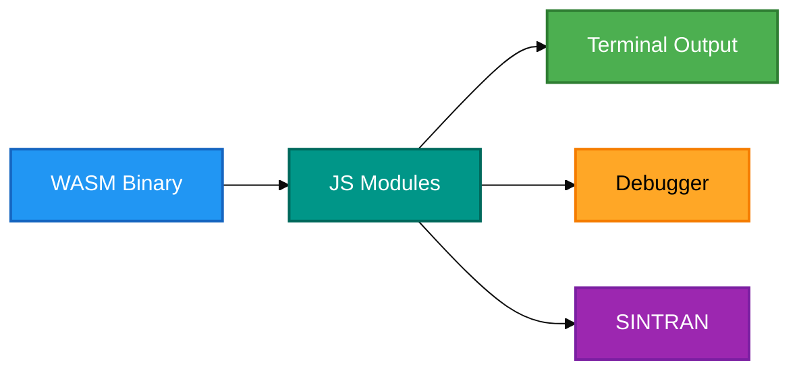
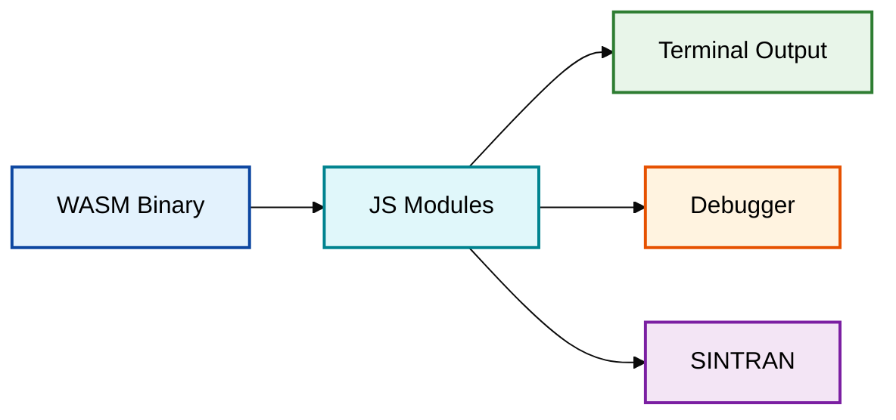

# Mermaid Diagram Color Standards - ND100X

Accessibility-focused color standardization for all Mermaid diagrams in the ND100X project.
Compliant with **WCAG 2.1 Level AA** (European Accessibility Act 2025).

> Adapted from the [NDInsight Mermaid Color Standards](https://github.com/HackerCorpLabs/NDInsight/blob/main/MERMAID_COLOR_STANDARDS.md) and tailored for ND100X emulator documentation.

---

## Core Color Palette

All colors meet the WCAG 2.1 Level AA minimum contrast ratio of 4.5:1.

### Primary Colors

| Color | Fill | Stroke | Text | Contrast | Use Case |
|-------|------|--------|------|----------|----------|
| Sky Blue | `#2196F3` | `#1565C0` | `#fff` | 4.55:1 | Hardware, WASM module, I/O ports |
| Teal | `#009688` | `#00695C` | `#fff` | 4.54:1 | Processing, JS modules, data flow |
| Red | `#F44336` | `#C62828` | `#fff` | 4.74:1 | Critical paths, interrupts, errors |
| Green | `#4CAF50` | `#2E7D32` | `#fff` | 4.52:1 | Output, terminal, success states |
| Amber | `#FFA726` | `#F57C00` | `#000` | 4.54:1 | Active states, user actions, warnings |

### Extended Palette

| Color | Fill | Stroke | Text | Contrast | Use Case |
|-------|------|--------|------|----------|----------|
| Indigo | `#3F51B5` | `#283593` | `#fff` | 5.89:1 | Symbol resolution, address maps |
| Magenta | `#E91E63` | `#AD1457` | `#fff` | 4.76:1 | Code generation, build pipeline |
| Purple | `#9C27B0` | `#7B1FA2` | `#fff` | 5.26:1 | SINTRAN, OS inspection, special |

### Light Fill Variant (for high-density diagrams)

When diagrams have many nodes and need lighter fills for readability, use this alternative palette. These use dark text on light backgrounds.

| Color | Fill | Stroke | Text | Contrast | Use Case |
|-------|------|--------|------|----------|----------|
| Light Blue | `#E3F2FD` | `#0D47A1` | `#000` | 11.16:1 | Hardware, WASM, I/O |
| Light Teal | `#E0F7FA` | `#00838F` | `#000` | 9.43:1 | Processing, JS modules |
| Light Green | `#E8F5E9` | `#2E7D32` | `#000` | 9.89:1 | Output, terminal |
| Light Purple | `#F3E5F5` | `#7B1FA2` | `#000` | 9.25:1 | SINTRAN, special |
| Light Orange | `#FFF3E0` | `#E65100` | `#000` | 8.91:1 | Debugger, highlighted |
| Light Dark Teal | `#E0F2F1` | `#00695C` | `#000` | 9.76:1 | Expansion, buses |

---

## Semantic Color Assignment

### ND100X Emulator Components

| Component | Primary | Light Variant | Rationale |
|-----------|---------|---------------|-----------|
| WASM binary / C code | Sky Blue | Light Blue | Hardware/system layer |
| JavaScript modules | Teal | Light Teal | Processing/translation layer |
| Terminal / output | Green | Light Green | User-visible output |
| Debugger | Amber | Light Orange | Active investigation |
| SINTRAN inspectors | Purple | Light Purple | OS-specific special tooling |
| Error states | Red | - | Critical/interrupt |
| User actions | Amber | Light Orange | Interactive elements |

### Architecture Diagrams

- **WASM Module** (nd100wasm.js, .wasm binary): Sky Blue
- **JS Modules** (emulation.js, toolbar.js, etc.): Teal
- **Terminal** (xterm.js, terminal output): Green
- **Debugger** (debugger.js, disassembly.js, breakpoints.js): Amber / Light Orange
- **SINTRAN** (sintran*.js, OS detection, inspectors): Purple / Light Purple
- **CPU Core** (cpu.c, cpu_types.h): Sky Blue
- **Devices** (console, floppy, SMD): Green

### State & Flow Indicators

| State | Color | Fill Code |
|-------|-------|-----------|
| Running / Active | Green | `#4CAF50` |
| Paused / Breakpoint | Amber | `#FFA726` |
| Stopped / Error | Red | `#F44336` |
| Data transfer | Teal | `#009688` |
| Idle / Unknown | Light Blue | `#E3F2FD` |

---

## Mermaid Syntax

### Class-Based Styling (Recommended)



### Light Fill Variant (for dense diagrams)



### Inline Style (when classDef is impractical)

```
style A fill:#2196F3,stroke:#1565C0,stroke-width:2px,color:#fff
style B fill:#009688,stroke:#00695C,stroke-width:2px,color:#fff
```

---

## Copy-Paste classDef Blocks

### Primary (dark fills, white text)

```
classDef wasm fill:#2196F3,stroke:#1565C0,stroke-width:2px,color:#fff
classDef jsmod fill:#009688,stroke:#00695C,stroke-width:2px,color:#fff
classDef terminal fill:#4CAF50,stroke:#2E7D32,stroke-width:2px,color:#fff
classDef debugger fill:#FFA726,stroke:#F57C00,stroke-width:2px,color:#000
classDef sintran fill:#9C27B0,stroke:#7B1FA2,stroke-width:2px,color:#fff
classDef error fill:#F44336,stroke:#C62828,stroke-width:2px,color:#fff
classDef symbol fill:#3F51B5,stroke:#283593,stroke-width:2px,color:#fff
classDef build fill:#E91E63,stroke:#AD1457,stroke-width:2px,color:#fff
```

### Light (light fills, dark text)

```
classDef wasm fill:#E3F2FD,stroke:#0D47A1,stroke-width:2px,color:#000
classDef jsmod fill:#E0F7FA,stroke:#00838F,stroke-width:2px,color:#000
classDef terminal fill:#E8F5E9,stroke:#2E7D32,stroke-width:2px,color:#000
classDef debugger fill:#FFF3E0,stroke:#E65100,stroke-width:2px,color:#000
classDef sintran fill:#F3E5F5,stroke:#7B1FA2,stroke-width:2px,color:#000
classDef bus fill:#E0F2F1,stroke:#00695C,stroke-width:2px,color:#000
```

---

## VS Code Mermaid Compatibility

### Prohibited in Node Labels

| Pattern | Problem | Fix |
|---------|---------|-----|
| Hyphens | `[ND-100 CPU]` breaks parser | `[ND100 CPU]` |
| Slashes | `[I/O Proxy]` breaks parser | `[IO Proxy]` |
| Colons | `[Type: Memory]` breaks parser | `[Type Memory]` |
| HTML tags | `<br/>` in labels | Use line breaks with `<br>` only in init config |
| Parentheses in subgraph | `subgraph "Memory (5MPM)"` | `subgraph Memory 5MPM` |

### Required

- Quote arrow labels with special characters: `-->|"Label text"|`
- Use alphanumeric + spaces only in node labels
- Test in VS Code preview (Ctrl+Shift+V) before committing

---

## Colorblind Accessibility

### Safe Combinations

| Pair | Safe for |
|------|----------|
| Blue + Red | Deuteranopia, Protanopia |
| Blue + Green | Deuteranopia, Protanopia |
| Purple + Orange | Deuteranopia, Protanopia |
| Red + Blue | Tritanopia |
| Green + Purple | Tritanopia |

### Avoid Adjacent

| Pair | Problematic for |
|------|-----------------|
| Red + Green | Deuteranopia, Protanopia |
| Red + Amber | Deuteranopia, Protanopia |
| Blue + Cyan | Tritanopia |
| Amber + Green | Tritanopia |

### Best Practice

Never rely on color alone for critical distinctions. Combine with:
- Text labels inside nodes
- Different node shapes (rectangle vs diamond vs circle)
- Dashed vs solid line styles

---

## Testing & Compliance

### Contrast Testing Tools

- [WebAIM Contrast Checker](https://webaim.org/resources/contrastchecker/)
- Firefox DevTools (Accessibility pane)
- Chrome DevTools (Elements > Accessibility)

### Test Against Backgrounds

| Background | Hex | Context |
|------------|-----|---------|
| White | `#FFFFFF` | Print, light themes |
| Light gray | `#F5F5F5` | GitHub light mode |
| Dark | `#0D1117` | GitHub dark mode |

### Pre-Commit Checklist

1. All text meets 4.5:1 contrast minimum against its fill color
2. No hyphens, slashes, or special characters in node labels
3. Tested rendering in VS Code preview and GitHub
4. Colorblind-safe: no red-green adjacency without labels
5. Color assignments match the semantic table above

---

## Source & Standards

- **Based on**: Material Design Color Palette (Google)
- **Compliance**: WCAG 2.1 Level AA (4.5:1 minimum contrast)
- **Parent reference**: [NDInsight MERMAID_COLOR_STANDARDS.md](https://github.com/HackerCorpLabs/NDInsight/blob/main/MERMAID_COLOR_STANDARDS.md)
- **Alternative palettes considered**: IBM Design Language, Tableau 10 colorblind-safe, Okabe-Ito
