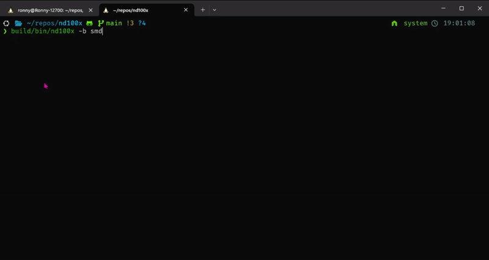
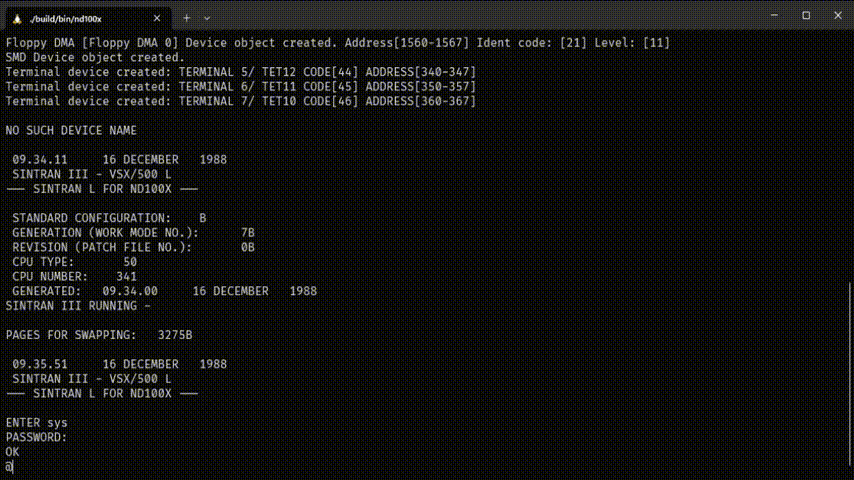

# nd100x

ND-100/CX Emulator written in C

For more information about the ND-100 series of minicomputers: <https://www.ndwiki.org/wiki/ND-100>

# Origins

This project (nd100x) is a fork of nd100em, started in 2025 by Ronny Hansen.
It remains under the GNU General Public License (GPL v2 or later).

This project is based upon the source code from the nd100em project.
Their latest version was version 0.2.4, which can be found here <https://github.com/tingox/nd100em>
Read more about the nd100em project here <https://www.ndwiki.org/wiki/ND100_emulator_project>

The original authors of the nd100em are:

* Per-Olof Åström
* Roger Abrahamsson
* Zdravko Dimitrov
* Göran Axelsson

## Status

The emulator is under active development. Current work in progress includes:

* All test programs validate the CPU, Memory Management and Devices.
* Missing some opcodes around BCD
* Boots SINTRAN L from SMD in 6-7 seconds on my machine.

## Improvements

This project continues from nd100em version 0.2.4 and includes significant enhancements:

* **Opcode Improvements**
  * Added support for missing opcodes
  * Fixed bugs in several instructions
* **Memory Management**
  * Fully re-implemented with support for MMS1 and MMS2
  * Proper TRAP generation for Page Faults and Access Violations
* **IO Subsystem**
  * Complete rewrite: now single-threaded and simplified
  * Old IO code has been removed
* **Supported IO Devices**
  * Real-Time Clock (20ms tick emulation pending for full SINTRAN compatibility)
  * Console and additional terminals (up to 11 terminals, with telnet server for remote access)
  * Floppy (PIO and DMA) for 8" and 5.25" formats
  * SMD Hard Disk (75MB; multi-drive support in progress)
  * Paper Tape Reader (buffer-based, BPUN file loading via CLI or Glass UI upload)
  * Paper Tape Punch (output to file and Glass UI hex/ASCII display with download)
  * Line Printer (CDC 9380, output to file and Glass UI window)
* **Codebase Modernization**
  * Removed requirement for libconfig and the supporting .conf file. All options are now given on the command line.
  * Refactored folder structure
  * Automatic function header generation via [mkptypes](https://github.com/OrangeTide/mkptypes) (by Eric R. Smith)

## Project Goals

* Focus on ND-100 CPU and controllers.
  * The newer CPU's (ND-110 and ND-120) is mostly hardware/performance improvements, with some new opcodes to support SINTRAN and COBOL running with better performance.
  * Focus on getting these opcodes into this emulator has very low priority, as SINTRAN doesnt require an ND-110 or ND-120 CPU.
* Refactorand, re-structure and modernize code so its easier to extend
* Adding support for building different frontends
  * The only frontend currently is the nd100x emulator
  * Other frond ends planned
    * Web Assembly version (WASM) for running emulator in browser and in Visual Studio Code as plugin
    * Arduino, ESP and RISC-V device support.
    * Emulator with debug interface
    * Windows version
* Adding even more devices (like HDLC, Ethernet, SCSI)

## Project Structure

The project is organized into several key components:

* `src/cpu/` - CPU emulation implementation
* `src/devices/` - Device emulation (I/O, peripherals)
* `src/machine/` - Machine state and main emulation loop
* `src/ndlib/` - Supporting library functions (loading BPUN and a.out formats++)
* `src/debugger/` - DAP Debugger supporting functionality
* `src/frontend/` - User interface and emulator frontend(s)
* `tools/` - Development and build tools
* `images/` - Norsk-Data SMD disk, floppy and BPUN files.
* `build/` - Build output directory

## Build Requirements

- Linux (Ubuntu 22.04 or later) or macOS (12 Monterey or later)
- GCC or Clang compiler
- CMake 3.14+
- Make build system
- mkptypes tool (automatically built during compilation)

### Additional Dependencies for Floppy Menu

The floppy menu functionality requires additional libraries:
* **libcurl4-openssl-dev**: For downloading floppy database from the internet
* **libncurses5-dev**: For the terminal-based user interface

Install these dependencies on Ubuntu/Debian:

```bash
sudo apt update
sudo apt install libcurl4-openssl-dev libncurses5-dev
```

On FreeBSD

```bash
pkg install curl ncurses
```

**Note**: The floppy menu requires an internet connection to function properly.

**Note 2**: The floppy menu is disabled on RISC-V and WASM builds.

## Building the Project

1. Clone the repository:

```bash
git clone https://github.com/HackerCorpLabs/nd100x.git
cd nd100x

git submodule update --init --recursive

```

1. Build the project:

- For debug build (default):

```bash
make debug
```

- For release build:

```bash
make release
```

- For build with sanitizers:

```bash
make sanitize
```

* For more information on the build system, see the [How to build document](docs/HOWTO_BUILD.md).
* Support for WebAssembly builds has been added, for more information see the [How to build WASM document](docs/HOWTO_BUILD_WASM.md)
* Support for Risc-V builds has been added, for more information see the [How to build RISC-V document](docs/HOWTO_BUILD_RISCV.md)

### Building on Windows

A native Windows build is produced via **MinGW-w64** — either [w64devkit](https://github.com/skeeto/w64devkit) (portable, no installer) or MSYS2 MINGW64. The CMake root picks up `_WIN32` automatically and forces the Ninja generator.

**Quick path (w64devkit):**

1. Download and extract [w64devkit](https://github.com/skeeto/w64devkit/releases) to `C:\Utils\w64devkit\` (or set `W64DEVKIT` to wherever you unpacked it).
2. From a regular `cmd.exe` at the repo root:

   ```cmd
   build.bat debug
   ```

   That stages `w64devkit\bin` on PATH for the session, runs `make debug`, and leaves `build\bin\nd100x.exe` ready to run. Use `build.bat release` for an optimised build, `build.bat clean` to wipe build directories.

**Current limitations on Windows** (these are gated at build time; Linux is unaffected):

- `--debugger` (DAP server) is unavailable — `external/libdap` uses POSIX-only socket headers and hasn't been ported yet.
- `--boot=aout` is unavailable — `external/libsymbols` needs the same treatment.
- The F12 floppy-database browser is compiled out — it uses ncurses, which w64devkit doesn't ship. Use `--boot=bpun`, `--boot=floppy`, or `--boot=smd` with a local image instead.
- `libcurl` is optional. If missing, HTTP image-URL loads fall back to stubs; local disk images still work. Install `mingw-w64-x86_64-curl` under MSYS2 to restore URL loads.

BPUN, SMD, floppy boot and the telnet server all work natively on Windows.

## Glass Web UI

The emulator includes a glassmorphism browser frontend (the "Glass UI") that runs the full ND-100 emulator in your browser. The live version at **<https://nd100x.hackercorp.no/>** has been upgraded to use this layout.

Build and run locally:

```bash
make wasm-glass-run
```

Features include draggable/resizable floating windows, an xterm.js VT100 terminal, a full CPU debugger with breakpoints and disassembly, SINTRAN III operating system inspection tools, a hardware page table viewer, Line Printer and Paper Tape device windows, and 5 switchable color themes.

The Glass UI source lives in `template-glass/` (1 HTML, 2 CSS, 23 JS modules, 1 JSON data file). For the full architecture reference, see [GLASS.md](GLASS.md).

## Updating Git submodules

Sometimes the submodules are updated and you need to manually refresh them

* git submodule update --init --recursive

### Command Line Options for nd100x

The emulator supports the following command line options:

```bash
Usage: nd100x [options]

Options:
  -b, --boot=TYPE        Boot type (bp, bpun, aout, floppy, smd)
  -i, --image=FILE       Image file to load
  -s, --start=ADDR       Start address (default: 0)
  -a, --disasm           Enable disassembly output (dump after emulator stops)
  -d, --debugger         Enable DAP debugger
  -p, --port=PORT        Set debugger port (default: 4711)
  -S, --smd-debug        Enable SMD disk controller debug log (stderr)
  -t, --trace            Enable CPU execution trace to stderr
  -n, --max-instr=N      Stop after N instructions
  -B, --breakpoint=ADDR  Stop at address (octal/hex/decimal)
  -T, --text-start=ADDR  Text segment load address for a.out (default: 0)
  -e, --tape=FILE        Paper tape file to load into reader
  -P, --printdir=DIR     Directory for line printer output files (default: ./prints)
  -D, --tapedir=DIR      Directory for paper tape punch output files (default: ./tapes)
  -r, --printer=TYPE     Printer emulation: text (default), escp, laser
  -f, --printformat=FMT  Output format: txt (default), pdf
  -N, --telnet[=PORT]    Enable telnet server (default port: 9000)
  -v, --verbose          Enable verbose output
  -h, --help             Show this help message

Examples:

  build/bin/nd100x -b aout -i a.out -v -d    # Loads an a.out file in verbose mode with debugger

  build/bin/nd100x -b bpun -i images/FILSYS-INV-Q04.BPUN      # Loads FILSYSTEM INVESTIGATOR
  build/bin/nd100x -b bpun -i images/CONFIGURATIO-C08.BPUN    # Loads CONFIGURATION-C08
  build/bin/nd100x -b bpun -i images/INSTRUCTION-B.BPUN       # Loads INSTRUCTION VERIFIER

  build/bin/nd100x -b floppy                                   # Boots from FLOPPY.IMG

  build/bin/nd100x -b floppy -e images/test.bpun               # Boots from floppy with paper tape loaded
  build/bin/nd100x -b smd --printdir=/tmp/prints               # Boots SINTRAN, printer output to /tmp/prints/
  build/bin/nd100x -b smd --telnet=9000                        # Boots SINTRAN with telnet server on port 9000
```

Boot Types:
* `smd`: SMD disk boot (default)
* `bp`: Boot program
* `bpun`: Boot program unprotected
* `aout`: BSD 2.11 a.out format
* `floppy`: Floppy disk boot

### Block devices (Floppy and SMD)

Currently the file names used for floppy and SMD are hard coded.
And the files are expected to be in the current folder.

* Floppy drives uses FLOPPY.IMG
* SMD  drives uses SMD0.IMG, SMD1.IMG, SMD2.IMG and SMD3.IMG.

Other floppy images can be mounted via the Floppy Menu

## Running SINTRAN in the Emulator

The emulator requires a system image file (SMD0.IMG) to run. Place the image file in the project root directory.

To boot a SINTRAN image from an SMD disk

```bash
build/bin/nd100x --boot=smd 
```

Read more about [how to boot sintran](SINTRAN.md)



## Booting TPE-MON from floppy and running test programs

The emulator requires a floppy image to boot from. Place the image file in the current directory.

```bash
cp images/Nd-210523I01-XX-01D.img FLOPPY.IMG
build/bin/nd100x --boot=floppy
```

Now you have access to test programs like CONFIG, PAGING, INSTRUCTION and more.

## Character Devices

The emulator supports three character I/O devices ported from the RetroCore emulator:

### Paper Tape Reader (I/O 0400-0403)
Reads BPUN tape images loaded via the `--tape` CLI option or the Glass UI file upload. Used by TPE and SINTRAN as logical device 2.

### Paper Tape Punch (I/O 0410-0413)
Accumulates punched output in memory. In native mode, output is saved to files in the tape directory (default: `./tapes/`). In the Glass UI, a hex/ASCII display shows punched bytes with a download button.

### Line Printer (I/O 0430-0433)
CDC 9380 line printer emulation. In native mode, output is saved to files in the print directory (default: `./prints/`). In the Glass UI, a dedicated window shows printer output in real-time.

### Virtual Screen Switching (Native)
Press **Alt+1** through **Alt+9** to switch directly between virtual screens (Console, terminals, Line Printer, Paper Tape Punch, Log). Press **F12** for the unified menu offering Floppy Database Browser, Virtual Screen Selector, and Pending Connections viewer. Only terminal screens accept keyboard input; device screens are output-only.

### Telnet Server (Native)
Enable with `--telnet[=PORT]` (default port 9000). Provides remote terminal access to terminals 8-11. Multiple clients can connect simultaneously and select from available terminals. Features include:
* Non-blocking accept with concurrent pending client handling
* 60-second auto-disconnect for idle pending connections
* Live monitoring of pending connections with rx/tx byte stats (via F12 menu)
* Per-terminal rx/tx byte counters visible in the Virtual Screen Selector
* Press Enter to auto-connect to the first available terminal
* Race-safe selection: if two clients pick the same terminal, the second gets a "busy" message and a refreshed list instead of a silent redirect
* Immediate disconnect with message when no terminals are free

## Floppy Menu

The emulator includes a built-in floppy disk browser that allows you to browse and mount floppy disk images from the ND100 floppy database.

### Accessing the Menu

While the emulator is running, press **F12** to open the floppy menu.



### Menu Features

* **Browse Database**: View all available floppy disk images from the online database
* **Search Functionality**: Search for floppies by name, reference, or directory content
* **Detailed Information**: View detailed information about each floppy including description, reference and directory content
* **Mount Capability**: Mount selected floppy disks to floppy drive units 0, 1 or 2

### Requirements

* Internet connection (required to download floppy database).
* Terminal that supports F12 key

Floppy database is available directly at <https://ndlib.hackercorp.no/>

## Assembling your own programs

Using the assembly tool from Ragge [nd100-as](https://github.com/ragge0/norsk_data/tree/main/nd100-as) you can compile ND assembly to a.out format and load into the emulator.

This assembler is following the AT&T syntax so it differs a bit from the ND-100 MAC assembler.

```asm
lda foo
sta bar
opcom


bar: .word 11
foo: .word 22
```

Remember to end your code with 'opcom' to make the emulator stop executing your code.

Overview of all [assembly instructions](docs/cpu_documentation.md)

## Multiple systems

The nd100x emulator has been compuiled and tested on multiple different systems.
For more information, read the [Tested systems](docs/SYSTEMS.md) document

## Releases (GitHub Actions)

Pre-built binaries for Windows and macOS are produced automatically by `.github/workflows/build-windows.yml`. The workflow publishes a GitHub Release when a tag matching `v*` is pushed.

| Artifact | Target | How it's built |
|----------|--------|----------------|
| `nd100x-windows-x64.zip` | Windows 64-bit | `windows-latest`, MSYS2 MINGW64 (`mingw-w64-x86_64-gcc` + `ninja`), `make release` |
| `nd100x-macos-arm64.tar.gz` | macOS Apple Silicon | `macos-latest`, Homebrew cmake, `make release` |

The Windows zip contains `nd100x.exe` plus every non-system DLL the exe depends on (libcurl + its transitive deps, `libgcc_s_seh-1`, `libwinpthread-1`, ...), the repo's bundled `images/` directory, `README.md`, and `LICENSE`. DLL discovery is driven by `ldd` so the bundle tracks whatever MSYS2 ships — no hardcoded list to maintain.

### Cutting a release

```bash
git tag v0.1.0
git push origin v0.1.0
```

The push triggers the workflow, which builds the binary, re-zips the staged directory, and uploads the zip to a new GitHub Release with auto-generated release notes.

### Manual dispatch

`Actions → Build Windows → Run workflow` triggers a dry build (zip uploaded as a workflow artifact, no release published).

## License

See the [LICENSE](LICENSE) file for detailed licensing information.

## Contributing

See the [CONTRIBUTING.md](CONTRIBUTING.md) file for more information

## TODO

* Refactor IO access to request BLOCKs from Machine instead of direct file access
  * Opens up for running WASM in the browser with better performance/less memory usage.
* OPCOM implementation
  * Emulation of OPCOM for memory inspection when CPU is in STOP mode.
  * Currently STOP mode exits the emulator
* Clean up code and standardise on 8,16,32 and 64 bit signed and unsigned names for types
