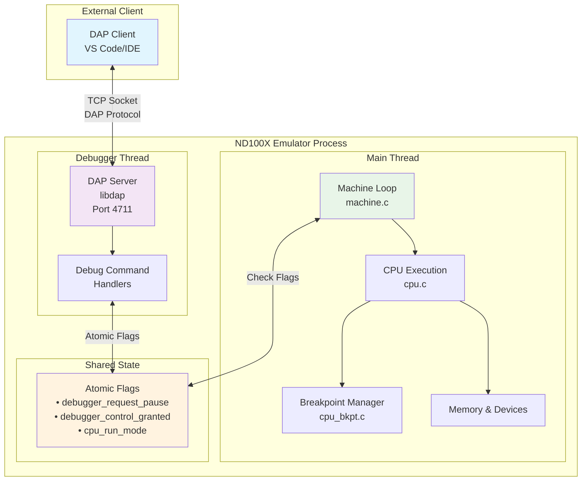
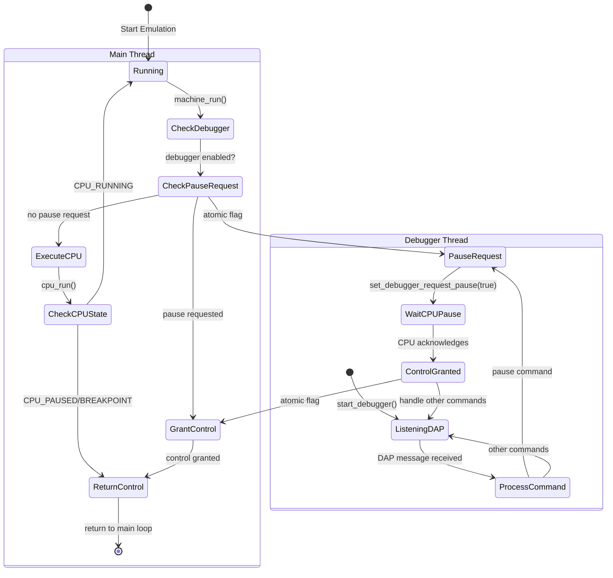
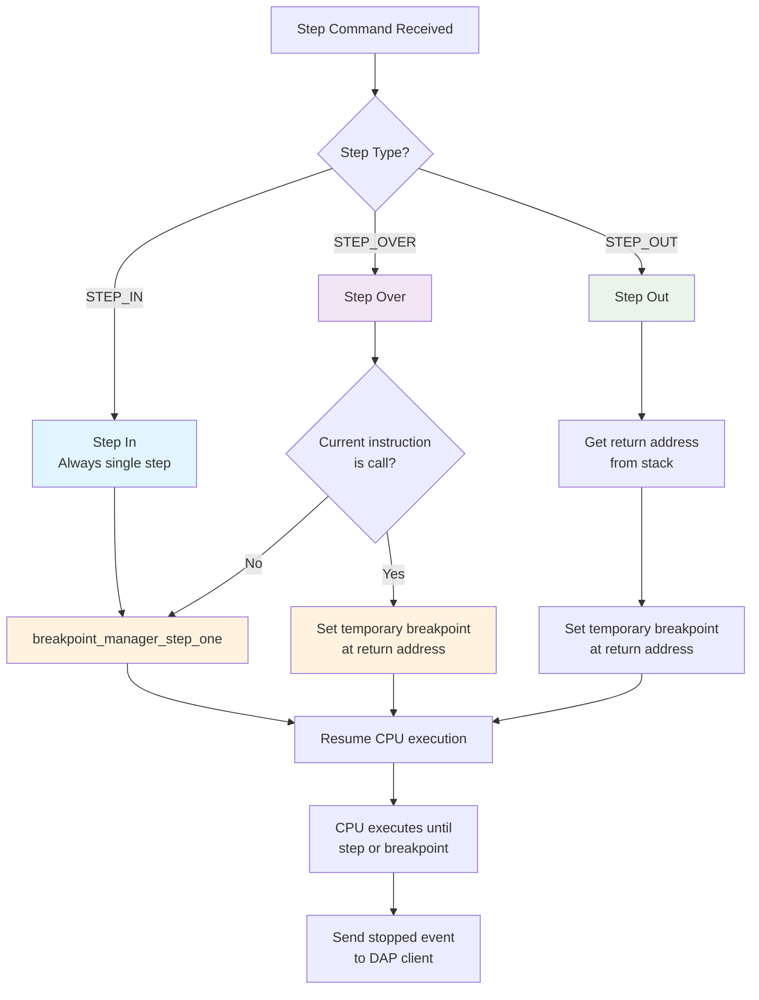
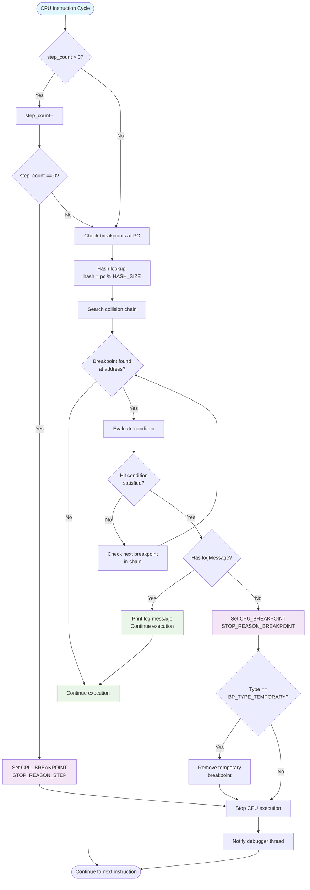
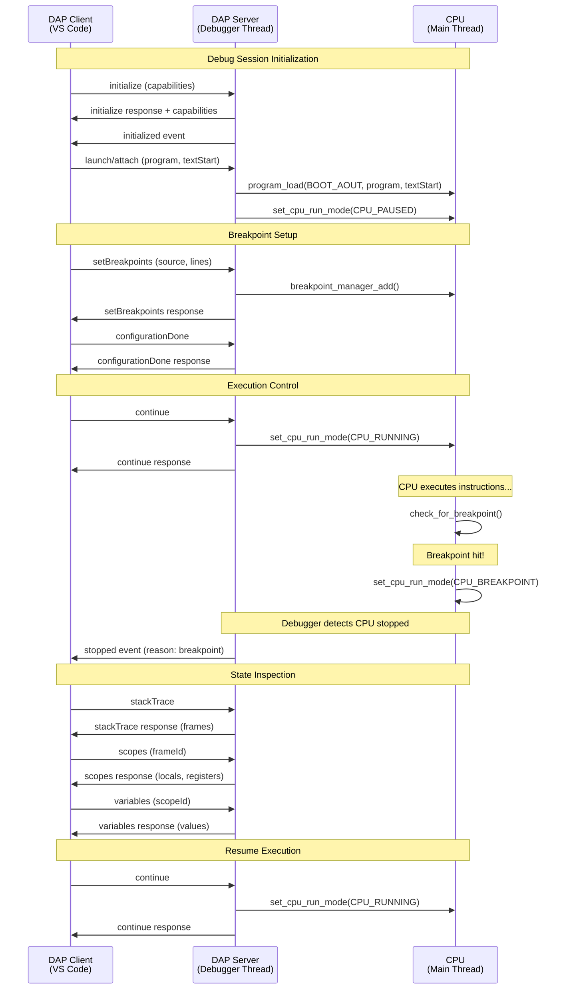

# DAP Debugger Integration Analysis - ND100X Emulator

## Overview

The ND100X emulator implements a sophisticated Microsoft Debug Adapter Protocol (DAP) integration that provides full-featured debugging capabilities. This analysis examines the architecture, implementation patterns, and interactions between components that enable debugging of emulated ND-100 programs.

## 🆕 Latest Updates (October 2025)

**Mixed-Language Debug Support Implemented!**

The DAP integration has been significantly enhanced to support mixed C and assembly debugging. See new documentation:

- **`docs/DAP_UPDATES_README.md`** - Start here for overview of changes
- **`docs/DAP_CAPABILITIES_ANALYSIS.md`** - Complete capability audit
- **`docs/DAP_IMPLEMENTATION_SUMMARY.md`** - Implementation details
- **`docs/DAP_INTEGRATION_GUIDE.md`** - Complete integration guide
- **`docs/VSCODE_EXTENSION_UPDATES.md`** - VS Code extension changes
- **`docs/STABS_PARSER_IMPLEMENTATION.md`** - Remaining work (STABS parser)

**Key Improvements:**
- ✅ Honest capability advertising (removed false claims)
- ✅ Source reference system for non-disk files
- ✅ Multi-table symbol lookup (STABS → MAP → AOUT)
- ✅ Enhanced stack frames with source references
- ✅ Enhanced breakpoint resolution
- ✅ Source request command (NEW)
- ✅ VS Code extension updated for C and assembly
- ✅ Comprehensive documentation

**What Remains:**
- ⏳ Enhanced STABS parser (for full C debugging)
- ⏳ Expression evaluator (for conditional breakpoints)

## Architecture Overview

### Core Components

The DAP integration consists of four main components:

1. **Machine Layer** (`machine/machine.c`) - Main emulation loop with debugger coordination
2. **Debugger Layer** (`debugger/debugger.c`) - DAP server implementation and command handling
3. **CPU Layer** (`cpu/cpu.c`, `cpu/cpu_bkpt.c`) - Execution control and breakpoint management
4. **External DAP Library** (`external/libdap/`) - DAP protocol implementation

### Threading Model

The debugger uses a **dual-thread architecture**:

- **Main Thread**: Runs the emulator (machine + CPU execution)
- **Debugger Thread**: Runs the DAP server listening on port 4711

#### Thread Communication

Communication between threads uses atomic flags and CPU state management:

```c
// Atomic flags for thread coordination
static atomic_bool debugger_thread_should_exit = false;

// CPU state flags
bool gDebuggerEnabled;
static bool debugger_request_pause = false;
static bool debugger_control_granted = false;
```

### Integration Flow



## Machine Integration (machine/machine.c)

### Initialization

The machine initializes the debugger during startup:

```c
void machine_init(bool debuggerEnabled, ...)
{
    // Initialize the CPU with debugger flag
    cpu_init(debuggerEnabled);

    // Initialize CPU debugger (starts the debugger thread)
    init_cpu_debugger();

    // Set CPU to running mode
    set_cpu_run_mode(CPU_RUNNING);
}
```

### Main Execution Loop

The machine's main loop coordinates with the debugger:

```c
void machine_run(int ticks)
{
    while (get_cpu_run_mode() != CPU_SHUTDOWN)
    {
        ticks = cpu_run(ticks);

        // Check if DAP adapter has requested a pause
        if (gDebuggerEnabled)
        {
            if (get_debugger_request_pause())
            {
                if (!get_debugger_control_granted())
                {
                    set_debugger_control_granted(true);
                }
            }

            usleep(100000); // Sleep 100ms - prevents busy waiting

            // Exit if CPU is paused or hit breakpoint
            if ((get_cpu_run_mode() == CPU_PAUSED) ||
                (get_cpu_run_mode() == CPU_BREAKPOINT))
            {
                return; // exit back to main loop
            }
        }

        if (ticks == 0) return; // No more ticks to run
    }
}
```

**Key Points:**
- Machine checks debugger requests on every iteration
- Uses 100ms sleep to prevent busy waiting when debugger is active
- Grants control to debugger when pause is requested
- Returns control to main loop when CPU is paused/breakpoint hit

### Thread Coordination Flow



## Debugger Implementation (debugger/debugger.c)

### Thread Management

```c
void start_debugger()
{
    // Start the debugger thread
    pthread_create(&p_debugger_thread, NULL, debugger_thread, NULL);
}

void *debugger_thread(void *arg)
{
    int port = 4711;
    int ret = ndx_server_init(port);

    printf("NDX debugger listening on port %d...\n", port);

    // Run the server's message processing loop
    while (server->is_running)
    {
        if (atomic_load(&debugger_thread_should_exit))
            break;

        if (dap_server_run(server) != 0)
            break;

        usleep(10000); // 10ms sleep
    }

    // Cleanup
    dap_server_stop(server);
    dap_server_free(server);
    THREAD_RETURN(0);
}
```

### Control Flow Management

The debugger implements sophisticated control flow management:

#### Pause/Resume Pattern

```c
// Request CPU to pause
static int pause_cpu_execution(DAPServer *server)
{
    if (get_cpu_run_mode() == CPU_SHUTDOWN)
        return -1; // CPU shutting down

    set_debugger_request_pause(true);

    // Wait for CPU to acknowledge pause
    int timeout = 5000; // 5 second timeout
    while (get_cpu_run_mode() == CPU_RUNNING && timeout > 0) {
        usleep(1000); // 1ms
        timeout--;
    }

    // CPU is paused; debugger now owns control
    set_debugger_control_granted(true);

    // Release debugger's request to pause
    set_debugger_request_pause(false);

    return (timeout > 0) ? 0 : -1;
}
```

#### Resume Pattern

```c
static int resume_cpu_execution(DAPServer *server)
{
    if (get_cpu_run_mode() == CPU_SHUTDOWN)
        return -1;

    if (get_cpu_run_mode() == CPU_PAUSED ||
        get_cpu_run_mode() == CPU_BREAKPOINT)
    {
        // CPU is paused, so we need to resume it
        set_cpu_run_mode(CPU_RUNNING);
        set_debugger_control_granted(false);
    }

    return 0;
}
```

### Step Implementation

The debugger implements all three DAP step types:



#### Step Over (STEP_OVER)
```c
if (step_type == STEP_OVER)
{
    // Check if current instruction is a call
    if (is_call_instruction(current_pc))
    {
        uint16_t return_address = current_pc + instruction_length;
        // Set temporary breakpoint at return address
        breakpoint_manager_add(return_address, BP_TYPE_TEMPORARY, NULL, NULL, NULL);
    }
    else
    {
        // Single step
        breakpoint_manager_step_one();
    }
}
```

#### Step In (STEP_IN)
```c
if (step_type == STEP_IN)
{
    // Always single step to next instruction
    breakpoint_manager_step_one();
}
```

#### Step Out (STEP_OUT)
```c
if (step_type == STEP_OUT)
{
    uint16_t return_address = get_return_address_from_stack();
    if (return_address != 0)
    {
        // Set temporary breakpoint at return address
        breakpoint_manager_add(return_address, BP_TYPE_TEMPORARY, NULL, NULL, NULL);
    }
}
```

### Breakpoint Management

```c
static int cmd_set_breakpoints(DAPServer *server)
{
    const char *source_path = server->current_command.context.breakpoint.source_path;
    int breakpoint_count = server->current_command.context.breakpoint.breakpoint_count;

    // Clear existing breakpoints
    breakpoint_manager_clear();

    // Process each breakpoint
    for (int i = 0; i < breakpoint_count; i++)
    {
        DAPBreakpoint *bp = &server->current_command.context.breakpoint.breakpoints[i];

        // Convert line number to address using symbol table
        uint16_t address = symbol_line_to_address(source_path, bp->line);

        // Add breakpoint to manager
        breakpoint_manager_add(
            address,
            BP_TYPE_USER,
            bp->condition,
            bp->hitCondition,
            bp->logMessage
        );
    }

    return 0;
}
```

## CPU Integration (cpu/cpu.c, cpu/cpu_bkpt.c)

### Debugger State Management

The CPU maintains debugger state:

```c
bool gDebuggerEnabled = false;
static bool debugger_request_pause = false;
static bool debugger_control_granted = false;

void init_cpu_debugger()
{
    if (gDebuggerEnabled) {
        start_debugger();

        // Set CPU to paused mode - wait for debugger commands
        set_cpu_run_mode(CPU_PAUSED);
    }
}
```

### Execution Loop Integration

```c
int cpu_run(int cycles)
{
    while (cycles > 0 && get_cpu_run_mode() == CPU_RUNNING)
    {
        // Check for debugger control
        if (get_debugger_control_granted()) {
            set_cpu_run_mode(CPU_PAUSED);
            return cycles; // Return remaining cycles
        }

        // Check for breakpoints before executing instruction
        check_for_breakpoint();

        // Execute instruction
        execute_instruction();

        // Check for debugger pause request
        if (gDebuggerEnabled && get_debugger_request_pause()) {
            set_cpu_run_mode(CPU_PAUSED);
            return cycles; // Return remaining cycles
        }

        cycles--;
    }

    return cycles;
}
```

### Breakpoint System (cpu/cpu_bkpt.c)

The CPU implements a hash-based breakpoint manager:

#### Breakpoint Architecture

```mermaid
graph TB
    subgraph "Breakpoint Manager"
        HashTable[Hash Table<br/>HASH_SIZE = 1024]
        StepCount[step_count<br/>for single stepping]
    end

    subgraph "Hash Buckets"
        Bucket0[Bucket 0]
        Bucket1[Bucket 1]
        BucketN[Bucket ...]
        Bucket1023[Bucket 1023]
    end

    subgraph "Breakpoint Chain (Address Collisions)"
        BP1[BreakpointEntry<br/>Address: 0x1000<br/>Type: USER<br/>Condition: "x > 5"]
        BP2[BreakpointEntry<br/>Address: 0x2000<br/>Type: TEMPORARY<br/>Condition: NULL]
        BP3[BreakpointEntry<br/>Address: 0x3000<br/>Type: FUNCTION<br/>logMessage: "Called func()"]
    end

    subgraph "Breakpoint Types"
        UserBP[BP_TYPE_USER<br/>User-set breakpoints]
        FuncBP[BP_TYPE_FUNCTION<br/>Function breakpoints]
        DataBP[BP_TYPE_DATA<br/>Data/watchpoint breakpoints]
        InstBP[BP_TYPE_INSTRUCTION<br/>Instruction breakpoints]
        TempBP[BP_TYPE_TEMPORARY<br/>Step over/out breakpoints]
    end

    HashTable --> Bucket0
    HashTable --> Bucket1
    HashTable --> BucketN
    HashTable --> Bucket1023

    Bucket1 --> BP1
    BP1 --> BP2
    BP2 --> BP3

    BP1 -.-> UserBP
    BP2 -.-> TempBP
    BP3 -.-> FuncBP

    style HashTable fill:#e1f5fe
    style BP1 fill:#f3e5f5
    style BP2 fill:#e8f5e8
    style BP3 fill:#fff3e0
```

#### Data Structures

```c
#define HASH_SIZE 1024

typedef enum {
    BP_TYPE_USER,        // User-set breakpoints
    BP_TYPE_FUNCTION,    // Function breakpoints
    BP_TYPE_DATA,        // Data/watchpoint breakpoints
    BP_TYPE_INSTRUCTION, // Instruction breakpoints
    BP_TYPE_TEMPORARY    // Temporary breakpoints (step over/out)
} BreakpointType;

typedef struct BreakpointEntry {
    uint16_t address;
    BreakpointType type;
    char *condition;     // Conditional expression
    char *hitCondition;  // Hit count condition
    char *logMessage;    // Log message for logpoints
    int hitCount;        // Number of times hit
    struct BreakpointEntry *next; // Hash collision chain
} BreakpointEntry;

typedef struct {
    BreakpointEntry *buckets[HASH_SIZE];
    int step_count;      // For single stepping
} BreakpointManager;
```

#### Breakpoint Checking Flow



#### Breakpoint Checking Implementation

```c
int check_for_breakpoint(void)
{
    uint16_t pc = gPC;

    // Check for single step
    if (mgr->step_count > 0) {
        mgr->step_count--;
        if (mgr->step_count == 0) {
            set_cpu_stop_reason(STOP_REASON_STEP);
            set_cpu_run_mode(CPU_BREAKPOINT);
            return STOP_REASON_STEP;
        }
    }

    // Check for breakpoints at current PC
    BreakpointEntry** hits;
    int hitCount;

    if (breakpoint_manager_check(pc, &hits, &hitCount)) {
        for (int i = 0; i < hitCount; i++) {
            BreakpointEntry* bp = hits[i];

            // Evaluate conditions
            bool condition_ok = true; // TODO: implement evaluator
            bool hit_ok = true;

            if (bp->hitCondition) {
                int hitCondVal = atoi(bp->hitCondition);
                hit_ok = (bp->hitCount == hitCondVal);
            }

            if (condition_ok && hit_ok) {
                if (bp->logMessage) {
                    printf("[LOGPOINT] %s\n", bp->logMessage);
                } else {
                    // Trigger stop
                    set_cpu_stop_reason(bp->type == BP_TYPE_TEMPORARY ?
                                       STOP_REASON_STEP : STOP_REASON_BREAKPOINT);
                    set_cpu_run_mode(CPU_BREAKPOINT);
                }

                // Auto-remove temporary breakpoints
                if (bp->type == BP_TYPE_TEMPORARY) {
                    breakpoint_manager_remove(bp->address, BP_TYPE_TEMPORARY);
                }
            }
        }
        free(hits);
    }

    return BT_NONE;
}
```

## DAP Protocol Commands

### Supported Commands

The implementation supports these key DAP commands:

#### Execution Control
- **initialize** - Initialize debug session with capabilities
- **launch/attach** - Start or attach to program (launch accepts optional `textStart` for a.out load address)
- **configurationDone** - Signal configuration complete
- **continue** - Resume execution
- **next** - Step over (F10)
- **stepIn** - Step into (F11)
- **stepOut** - Step out (Shift+F11)
- **pause** - Pause execution
- **terminate** - End debug session

#### Breakpoints
- **setBreakpoints** - Set line breakpoints
- **setExceptionBreakpoints** - Configure exception handling

#### Inspection
- **threads** - List execution threads
- **stackTrace** - Get call stack
- **scopes** - Get variable scopes (locals, registers)
- **variables** - Get variable values
- **evaluate** - Evaluate expressions
- **disassemble** - Get disassembly
- **readMemory/writeMemory** - Memory access

### Event Flow



## Symbol Table Integration

The debugger supports multiple symbol table formats:

```c
typedef struct {
    symbol_table_t *symbol_table_map;   // MAP files
    symbol_table_t *symbol_table_aout;  // a.out format
    symbol_table_t *symbol_table_stabs; // STABS debug info
} SymbolTables;
```

### Address/Line Conversion

```c
// Convert source line to memory address
uint16_t symbol_line_to_address(const char *file, int line);

// Convert memory address to source line
int symbol_address_to_line(uint16_t address, char **file);
```

## Key Features

### 1. Multi-Format Support
- BPUN files (boot program unprotected)
- a.out executables with symbol tables
- Assembly with MAP files

### 2. Comprehensive Breakpoint Support
- Line breakpoints with source mapping
- Conditional breakpoints
- Hit count breakpoints
- Temporary breakpoints (for stepping)
- Logpoints (breakpoints that log without stopping)

### 3. Variable Inspection
- CPU registers (A, B, D, etc.)
- Memory management registers (MMS1/MMS2)
- Status flags
- Memory contents with various formatting
- Local variables (when symbol info available)

### 4. Memory Debugging
- Direct memory read/write through DAP
- Disassembly view
- Memory dump in various formats

### 5. Advanced Features
- Stack trace with return address tracking
- Multiple threads support framework
- Exception handling hooks
- Module/source file listing

## Implementation Patterns for Other Emulators

### 1. Threading Architecture

**Pattern**: Use separate thread for DAP server to avoid blocking emulation

```c
// Main emulator thread
void emulator_main_loop() {
    while (running) {
        if (debugger_enabled && debugger_wants_control()) {
            yield_to_debugger();
            return;
        }
        execute_one_instruction();
    }
}

// Debugger thread
void* debugger_thread(void* arg) {
    start_dap_server(port);
    while (dap_server_running) {
        process_dap_messages();
        usleep(10000); // Prevent busy wait
    }
}
```

### 2. State Synchronization

**Pattern**: Use atomic flags for thread communication

```c
// Atomic coordination flags
static atomic_bool debugger_pause_requested = false;
static atomic_bool debugger_has_control = false;

// In emulator loop
if (atomic_load(&debugger_pause_requested)) {
    atomic_store(&debugger_has_control, true);
    atomic_store(&debugger_pause_requested, false);
    suspend_emulation();
}

// In debugger commands
void pause_command() {
    atomic_store(&debugger_pause_requested, true);
    wait_for_emulator_pause();
}
```

### 3. Breakpoint Management

**Pattern**: Hash table with collision chaining for fast lookups

```c
#define BREAKPOINT_HASH_SIZE 1024

typedef struct breakpoint {
    uint32_t address;
    int type;
    char* condition;
    struct breakpoint* next;
} breakpoint_t;

static breakpoint_t* breakpoint_table[BREAKPOINT_HASH_SIZE];

int check_breakpoint(uint32_t pc) {
    int hash = pc % BREAKPOINT_HASH_SIZE;
    breakpoint_t* bp = breakpoint_table[hash];

    while (bp) {
        if (bp->address == pc) {
            if (evaluate_condition(bp->condition)) {
                return bp->type;
            }
        }
        bp = bp->next;
    }
    return 0;
}
```

### 4. Step Implementation

**Pattern**: Use temporary breakpoints for step over/out

```c
void step_over() {
    uint32_t pc = get_program_counter();
    uint32_t next_pc = pc + get_instruction_length(pc);

    if (is_call_instruction(pc)) {
        // Set temporary breakpoint after call
        add_temporary_breakpoint(next_pc);
        resume_execution();
    } else {
        // Single step
        single_step();
    }
}

void step_out() {
    uint32_t return_address = get_return_address();
    if (return_address) {
        add_temporary_breakpoint(return_address);
        resume_execution();
    }
}
```

### 5. DAP Command Handling

**Pattern**: Register callback functions for each DAP command

```c
typedef int (*dap_command_handler)(dap_server_t* server, cJSON* args);

static struct {
    const char* command;
    dap_command_handler handler;
} command_table[] = {
    {"initialize", handle_initialize},
    {"launch", handle_launch},
    {"setBreakpoints", handle_set_breakpoints},
    {"continue", handle_continue},
    {"next", handle_next},
    {"stepIn", handle_step_in},
    {"stepOut", handle_step_out},
    // ...
};

void register_dap_commands(dap_server_t* server) {
    for (int i = 0; i < ARRAY_SIZE(command_table); i++) {
        dap_server_register_command(server,
                                   command_table[i].command,
                                   command_table[i].handler);
    }
}
```

## C# Interface Definitions

Based on the ND100X DAP implementation analysis, here are comprehensive C# interface definitions that can be used to implement DAP support in .NET-based emulators:

### C# Interface Architecture

**Core Interfaces** - Organized by functionality:
- **IDapServer** - Main server for handling debug sessions
- **IDapSessionHandler** - Session lifecycle (initialize, launch, disconnect, etc.)
- **IDapExecutionHandler** - Execution control (continue, step, pause)
- **IDapBreakpointHandler** - All breakpoint types (line, function, exception, data, instruction)
- **IDapInspectionHandler** - Variable and stack inspection
- **IDapMemoryHandler** - Memory operations and disassembly
- **IDapSourceHandler** - Source and module information

**Data Transfer Objects** - Complete request/response types:
- Session management (Initialize, Launch, Attach)
- Execution control (Continue, Next, StepIn, StepOut, Pause)
- Breakpoint requests (SetBreakpoints, SetFunctionBreakpoints, etc.)
- Inspection requests (Threads, StackTrace, Scopes, Variables)
- Memory requests (ReadMemory, WriteMemory, Disassemble)

**Core Data Types** - Full DAP specification coverage:
- Capabilities, Thread, StackFrame, Source, Scope, Variable
- Breakpoint types and presentation hints
- Value formatting and stepping granularity
- Exception handling structures

**Event Definitions** - Complete event system:
- InitializedEvent, StoppedEvent, ContinuedEvent
- TerminatedEvent, ExitedEvent, OutputEvent
- Proper event body structures with all required fields

**Key Features of the C# Implementation:**
1. **Async/Await Pattern** - All handlers use `Task<DapResponse>` for modern async programming
2. **Strongly Typed** - All DAP messages and structures are strongly typed
3. **Extensible** - Interface-based design allows for easy customization
4. **Complete Coverage** - Supports all DAP commands from the ND100X implementation
5. **Modern C#** - Uses nullable types, proper encapsulation, and modern patterns

The interfaces provide a solid foundation for implementing DAP support in any .NET-based emulator, following the exact patterns and capabilities demonstrated in the ND100X implementation.

### Core DAP Interfaces

```csharp
using System;
using System.Collections.Generic;
using System.Threading.Tasks;

namespace DebugAdapterProtocol
{
    /// <summary>
    /// Main DAP server interface for handling debug sessions
    /// </summary>
    public interface IDapServer
    {
        event EventHandler<DapEventArgs> EventReceived;
        event EventHandler<DapRequestArgs> RequestReceived;

        Task<bool> StartAsync(int port = 4711);
        Task StopAsync();
        Task<DapResponse> SendRequestAsync(DapRequest request);
        Task SendEventAsync(DapEvent evt);
        bool IsRunning { get; }
    }

    /// <summary>
    /// Interface for handling DAP session lifecycle
    /// </summary>
    public interface IDapSessionHandler
    {
        Task<DapResponse> HandleInitializeAsync(InitializeRequest request);
        Task<DapResponse> HandleLaunchAsync(LaunchRequest request);
        Task<DapResponse> HandleAttachAsync(AttachRequest request);
        Task<DapResponse> HandleConfigurationDoneAsync(ConfigurationDoneRequest request);
        Task<DapResponse> HandleDisconnectAsync(DisconnectRequest request);
        Task<DapResponse> HandleTerminateAsync(TerminateRequest request);
        Task<DapResponse> HandleRestartAsync(RestartRequest request);
    }

    /// <summary>
    /// Interface for handling execution control commands
    /// </summary>
    public interface IDapExecutionHandler
    {
        Task<DapResponse> HandleContinueAsync(ContinueRequest request);
        Task<DapResponse> HandleNextAsync(NextRequest request);
        Task<DapResponse> HandleStepInAsync(StepInRequest request);
        Task<DapResponse> HandleStepOutAsync(StepOutRequest request);
        Task<DapResponse> HandlePauseAsync(PauseRequest request);
        Task<DapResponse> HandleStepBackAsync(StepBackRequest request);
        Task<DapResponse> HandleReverseContinueAsync(ReverseContinueRequest request);
    }

    /// <summary>
    /// Interface for handling breakpoint operations
    /// </summary>
    public interface IDapBreakpointHandler
    {
        Task<DapResponse> HandleSetBreakpointsAsync(SetBreakpointsRequest request);
        Task<DapResponse> HandleSetFunctionBreakpointsAsync(SetFunctionBreakpointsRequest request);
        Task<DapResponse> HandleSetExceptionBreakpointsAsync(SetExceptionBreakpointsRequest request);
        Task<DapResponse> HandleSetDataBreakpointsAsync(SetDataBreakpointsRequest request);
        Task<DapResponse> HandleSetInstructionBreakpointsAsync(SetInstructionBreakpointsRequest request);
    }

    /// <summary>
    /// Interface for handling variable and stack inspection
    /// </summary>
    public interface IDapInspectionHandler
    {
        Task<DapResponse> HandleThreadsAsync(ThreadsRequest request);
        Task<DapResponse> HandleStackTraceAsync(StackTraceRequest request);
        Task<DapResponse> HandleScopesAsync(ScopesRequest request);
        Task<DapResponse> HandleVariablesAsync(VariablesRequest request);
        Task<DapResponse> HandleSetVariableAsync(SetVariableRequest request);
        Task<DapResponse> HandleEvaluateAsync(EvaluateRequest request);
        Task<DapResponse> HandleSetExpressionAsync(SetExpressionRequest request);
    }

    /// <summary>
    /// Interface for handling memory and disassembly operations
    /// </summary>
    public interface IDapMemoryHandler
    {
        Task<DapResponse> HandleReadMemoryAsync(ReadMemoryRequest request);
        Task<DapResponse> HandleWriteMemoryAsync(WriteMemoryRequest request);
        Task<DapResponse> HandleDisassembleAsync(DisassembleRequest request);
    }

    /// <summary>
    /// Interface for handling source and module information
    /// </summary>
    public interface IDapSourceHandler
    {
        Task<DapResponse> HandleSourceAsync(SourceRequest request);
        Task<DapResponse> HandleLoadedSourcesAsync(LoadedSourcesRequest request);
        Task<DapResponse> HandleModulesAsync(ModulesRequest request);
    }
}
```

### Data Transfer Objects

```csharp
namespace DebugAdapterProtocol.DataObjects
{
    public abstract class DapMessage
    {
        public int Seq { get; set; }
        public string Type { get; set; }
    }

    public class DapRequest : DapMessage
    {
        public string Command { get; set; }
        public object Arguments { get; set; }
    }

    public class DapResponse : DapMessage
    {
        public int RequestSeq { get; set; }
        public bool Success { get; set; }
        public string Command { get; set; }
        public string Message { get; set; }
        public object Body { get; set; }
    }

    public class DapEvent : DapMessage
    {
        public string Event { get; set; }
        public object Body { get; set; }
    }

    // Session Management Requests
    public class InitializeRequest
    {
        public string ClientId { get; set; }
        public string ClientName { get; set; }
        public string AdapterId { get; set; }
        public string PathFormat { get; set; } = "path";
        public bool LinesStartAt1 { get; set; } = true;
        public bool ColumnsStartAt1 { get; set; } = true;
        public bool SupportsVariableType { get; set; }
        public bool SupportsVariablePaging { get; set; }
        public bool SupportsRunInTerminalRequest { get; set; }
        public bool SupportsMemoryReferences { get; set; }
        public bool SupportsProgressReporting { get; set; }
        public bool SupportsInvalidatedEvent { get; set; }
    }

    public class LaunchRequest
    {
        public string Program { get; set; }
        public string[] Args { get; set; }
        public string Cwd { get; set; }
        public Dictionary<string, string> Env { get; set; }
        public bool StopOnEntry { get; set; }
        public bool NoDebug { get; set; }
        public int? TextStart { get; set; }  // Text segment load address (e.g. 0x1000 for -T 010000)
        public object AdditionalProperties { get; set; }
    }

    public class AttachRequest
    {
        public int? ProcessId { get; set; }
        public string Address { get; set; }
        public int? Port { get; set; }
        public object AdditionalProperties { get; set; }
    }

    // Execution Control Requests
    public class ContinueRequest
    {
        public int ThreadId { get; set; }
        public bool? SingleThread { get; set; }
    }

    public class NextRequest
    {
        public int ThreadId { get; set; }
        public bool? SingleThread { get; set; }
        public SteppingGranularity? Granularity { get; set; }
    }

    public class StepInRequest
    {
        public int ThreadId { get; set; }
        public bool? SingleThread { get; set; }
        public int? TargetId { get; set; }
        public SteppingGranularity? Granularity { get; set; }
    }

    public class StepOutRequest
    {
        public int ThreadId { get; set; }
        public bool? SingleThread { get; set; }
        public SteppingGranularity? Granularity { get; set; }
    }

    public class PauseRequest
    {
        public int ThreadId { get; set; }
    }

    // Breakpoint Requests
    public class SetBreakpointsRequest
    {
        public Source Source { get; set; }
        public SourceBreakpoint[] Breakpoints { get; set; }
        public bool? SourceModified { get; set; }
    }

    public class SetFunctionBreakpointsRequest
    {
        public FunctionBreakpoint[] Breakpoints { get; set; }
    }

    public class SetExceptionBreakpointsRequest
    {
        public string[] Filters { get; set; }
        public ExceptionFilterOptions[] FilterOptions { get; set; }
        public ExceptionOptions[] ExceptionOptions { get; set; }
    }

    // Inspection Requests
    public class ThreadsRequest { }

    public class StackTraceRequest
    {
        public int ThreadId { get; set; }
        public int? StartFrame { get; set; }
        public int? Levels { get; set; }
        public StackFrameFormat Format { get; set; }
    }

    public class ScopesRequest
    {
        public int FrameId { get; set; }
    }

    public class VariablesRequest
    {
        public int VariablesReference { get; set; }
        public string Filter { get; set; }
        public int? Start { get; set; }
        public int? Count { get; set; }
        public ValueFormat Format { get; set; }
    }

    public class EvaluateRequest
    {
        public string Expression { get; set; }
        public int? FrameId { get; set; }
        public string Context { get; set; }
        public ValueFormat Format { get; set; }
    }

    // Memory Requests
    public class ReadMemoryRequest
    {
        public string MemoryReference { get; set; }
        public int? Offset { get; set; }
        public int Count { get; set; }
    }

    public class WriteMemoryRequest
    {
        public string MemoryReference { get; set; }
        public int? Offset { get; set; }
        public bool? AllowPartial { get; set; }
        public string Data { get; set; } // Base64 encoded
    }

    public class DisassembleRequest
    {
        public string MemoryReference { get; set; }
        public int? Offset { get; set; }
        public int? InstructionOffset { get; set; }
        public int InstructionCount { get; set; }
        public bool? ResolveSymbols { get; set; }
    }
}
```

### Core Data Types

```csharp
namespace DebugAdapterProtocol.Types
{
    public class Capabilities
    {
        public bool? SupportsConfigurationDoneRequest { get; set; }
        public bool? SupportsFunctionBreakpoints { get; set; }
        public bool? SupportsConditionalBreakpoints { get; set; }
        public bool? SupportsHitConditionalBreakpoints { get; set; }
        public bool? SupportsEvaluateForHovers { get; set; }
        public bool? SupportsStepBack { get; set; }
        public bool? SupportsSetVariable { get; set; }
        public bool? SupportsRestartFrame { get; set; }
        public bool? SupportsGotoTargetsRequest { get; set; }
        public bool? SupportsStepInTargetsRequest { get; set; }
        public bool? SupportsCompletionsRequest { get; set; }
        public bool? SupportsModulesRequest { get; set; }
        public bool? SupportsRestartRequest { get; set; }
        public bool? SupportsExceptionOptions { get; set; }
        public bool? SupportsValueFormattingOptions { get; set; }
        public bool? SupportsExceptionInfoRequest { get; set; }
        public bool? SupportTerminateDebuggee { get; set; }
        public bool? SupportSuspendDebuggee { get; set; }
        public bool? SupportsDelayedStackTraceLoading { get; set; }
        public bool? SupportsLoadedSourcesRequest { get; set; }
        public bool? SupportsLogPoints { get; set; }
        public bool? SupportsTerminateThreadsRequest { get; set; }
        public bool? SupportsSetExpression { get; set; }
        public bool? SupportsTerminateRequest { get; set; }
        public bool? SupportsDataBreakpoints { get; set; }
        public bool? SupportsReadMemoryRequest { get; set; }
        public bool? SupportsWriteMemoryRequest { get; set; }
        public bool? SupportsDisassembleRequest { get; set; }
        public bool? SupportsCancelRequest { get; set; }
        public bool? SupportsBreakpointLocationsRequest { get; set; }
        public bool? SupportsClipboardContext { get; set; }
        public bool? SupportsSteppingGranularity { get; set; }
        public bool? SupportsInstructionBreakpoints { get; set; }
        public bool? SupportsExceptionFilterOptions { get; set; }
        public bool? SupportsSingleThreadExecutionRequests { get; set; }
    }

    public class Thread
    {
        public int Id { get; set; }
        public string Name { get; set; }
    }

    public class StackFrame
    {
        public int Id { get; set; }
        public string Name { get; set; }
        public Source Source { get; set; }
        public int Line { get; set; }
        public int Column { get; set; }
        public int? EndLine { get; set; }
        public int? EndColumn { get; set; }
        public bool? CanRestart { get; set; }
        public string InstructionPointerReference { get; set; }
        public string ModuleId { get; set; }
        public string PresentationHint { get; set; }
    }

    public class Source
    {
        public string Name { get; set; }
        public string Path { get; set; }
        public int? SourceReference { get; set; }
        public string PresentationHint { get; set; }
        public string Origin { get; set; }
        public Source[] Sources { get; set; }
        public object AdapterData { get; set; }
        public Checksum[] Checksums { get; set; }
    }

    public class Scope
    {
        public string Name { get; set; }
        public int VariablesReference { get; set; }
        public int? NamedVariables { get; set; }
        public int? IndexedVariables { get; set; }
        public bool? Expensive { get; set; }
        public Source Source { get; set; }
        public int? Line { get; set; }
        public int? Column { get; set; }
        public int? EndLine { get; set; }
        public int? EndColumn { get; set; }
    }

    public class Variable
    {
        public string Name { get; set; }
        public string Value { get; set; }
        public string Type { get; set; }
        public VariablePresentationHint PresentationHint { get; set; }
        public string EvaluateName { get; set; }
        public int VariablesReference { get; set; }
        public int? NamedVariables { get; set; }
        public int? IndexedVariables { get; set; }
        public string MemoryReference { get; set; }
    }

    public class VariablePresentationHint
    {
        public string Kind { get; set; }
        public string[] Attributes { get; set; }
        public string Visibility { get; set; }
        public bool? Lazy { get; set; }
    }

    public class Breakpoint
    {
        public int? Id { get; set; }
        public bool Verified { get; set; }
        public string Message { get; set; }
        public Source Source { get; set; }
        public int? Line { get; set; }
        public int? Column { get; set; }
        public int? EndLine { get; set; }
        public int? EndColumn { get; set; }
        public string InstructionReference { get; set; }
        public int? Offset { get; set; }
    }

    public class SourceBreakpoint
    {
        public int Line { get; set; }
        public int? Column { get; set; }
        public string Condition { get; set; }
        public string HitCondition { get; set; }
        public string LogMessage { get; set; }
    }

    public class FunctionBreakpoint
    {
        public string Name { get; set; }
        public string Condition { get; set; }
        public string HitCondition { get; set; }
    }

    public class DisassembledInstruction
    {
        public string Address { get; set; }
        public string InstructionBytes { get; set; }
        public string Instruction { get; set; }
        public string Symbol { get; set; }
        public Source Source { get; set; }
        public int? Line { get; set; }
        public int? Column { get; set; }
        public int? EndLine { get; set; }
        public int? EndColumn { get; set; }
    }

    public enum SteppingGranularity
    {
        Statement,
        Line,
        Instruction
    }

    public class ValueFormat
    {
        public bool? Hex { get; set; }
    }

    public class StackFrameFormat
    {
        public bool? Parameters { get; set; }
        public bool? ParameterTypes { get; set; }
        public bool? ParameterNames { get; set; }
        public bool? ParameterValues { get; set; }
        public bool? Line { get; set; }
        public bool? Module { get; set; }
        public bool? IncludeAll { get; set; }
    }

    public class ExceptionFilterOptions
    {
        public string FilterId { get; set; }
        public string Condition { get; set; }
    }

    public class ExceptionOptions
    {
        public ExceptionPathSegment[] Path { get; set; }
        public ExceptionBreakMode BreakMode { get; set; }
    }

    public class ExceptionPathSegment
    {
        public bool? Negate { get; set; }
        public string[] Names { get; set; }
    }

    public enum ExceptionBreakMode
    {
        Never,
        Always,
        Unhandled,
        UserUnhandled
    }

    public class Checksum
    {
        public string Algorithm { get; set; }
        public string Checksum { get; set; }
    }
}
```

### Event Definitions

```csharp
namespace DebugAdapterProtocol.Events
{
    public class InitializedEvent : DapEvent
    {
        public InitializedEvent()
        {
            Event = "initialized";
        }
    }

    public class StoppedEvent : DapEvent
    {
        public StoppedEvent(string reason, int? threadId = null)
        {
            Event = "stopped";
            Body = new StoppedEventBody
            {
                Reason = reason,
                ThreadId = threadId,
                AllThreadsStopped = true
            };
        }
    }

    public class StoppedEventBody
    {
        public string Reason { get; set; }
        public string Description { get; set; }
        public int? ThreadId { get; set; }
        public bool? PreserveFocusHint { get; set; }
        public string Text { get; set; }
        public bool? AllThreadsStopped { get; set; }
        public int[] HitBreakpointIds { get; set; }
    }

    public class ContinuedEvent : DapEvent
    {
        public ContinuedEvent(int threadId, bool allThreadsContinued = true)
        {
            Event = "continued";
            Body = new ContinuedEventBody
            {
                ThreadId = threadId,
                AllThreadsContinued = allThreadsContinued
            };
        }
    }

    public class ContinuedEventBody
    {
        public int ThreadId { get; set; }
        public bool? AllThreadsContinued { get; set; }
    }

    public class TerminatedEvent : DapEvent
    {
        public TerminatedEvent(bool restart = false)
        {
            Event = "terminated";
            Body = new TerminatedEventBody { Restart = restart };
        }
    }

    public class TerminatedEventBody
    {
        public bool? Restart { get; set; }
    }

    public class ExitedEvent : DapEvent
    {
        public ExitedEvent(int exitCode)
        {
            Event = "exited";
            Body = new ExitedEventBody { ExitCode = exitCode };
        }
    }

    public class ExitedEventBody
    {
        public int ExitCode { get; set; }
    }

    public class OutputEvent : DapEvent
    {
        public OutputEvent(string category, string output)
        {
            Event = "output";
            Body = new OutputEventBody
            {
                Category = category,
                Output = output
            };
        }
    }

    public class OutputEventBody
    {
        public string Category { get; set; }
        public string Output { get; set; }
        public string Group { get; set; }
        public int? VariablesReference { get; set; }
        public Source Source { get; set; }
        public int? Line { get; set; }
        public int? Column { get; set; }
        public object Data { get; set; }
    }
}
```

### Event Args and Utilities

```csharp
namespace DebugAdapterProtocol.Utilities
{
    public class DapEventArgs : EventArgs
    {
        public DapEvent Event { get; }

        public DapEventArgs(DapEvent evt)
        {
            Event = evt;
        }
    }

    public class DapRequestArgs : EventArgs
    {
        public DapRequest Request { get; }

        public DapRequestArgs(DapRequest request)
        {
            Request = request;
        }
    }

    public class ConfigurationDoneRequest { }
    public class DisconnectRequest
    {
        public bool? TerminateDebuggee { get; set; }
        public bool? Restart { get; set; }
        public bool? SuspendDebuggee { get; set; }
    }

    public class TerminateRequest
    {
        public bool? Restart { get; set; }
    }

    public class RestartRequest { }
    public class StepBackRequest
    {
        public int ThreadId { get; set; }
        public bool? SingleThread { get; set; }
        public SteppingGranularity? Granularity { get; set; }
    }

    public class ReverseContinueRequest
    {
        public int ThreadId { get; set; }
        public bool? SingleThread { get; set; }
    }

    public class SetDataBreakpointsRequest
    {
        public DataBreakpoint[] Breakpoints { get; set; }
    }

    public class SetInstructionBreakpointsRequest
    {
        public InstructionBreakpoint[] Breakpoints { get; set; }
    }

    public class SourceRequest
    {
        public int? SourceReference { get; set; }
        public Source Source { get; set; }
    }

    public class LoadedSourcesRequest { }
    public class ModulesRequest
    {
        public int? StartModule { get; set; }
        public int? ModuleCount { get; set; }
    }

    public class SetVariableRequest
    {
        public int VariablesReference { get; set; }
        public string Name { get; set; }
        public string Value { get; set; }
        public ValueFormat Format { get; set; }
    }

    public class SetExpressionRequest
    {
        public string Expression { get; set; }
        public string Value { get; set; }
        public int? FrameId { get; set; }
        public ValueFormat Format { get; set; }
    }

    public class DataBreakpoint
    {
        public string DataId { get; set; }
        public string AccessType { get; set; }
        public string Condition { get; set; }
        public string HitCondition { get; set; }
    }

    public class InstructionBreakpoint
    {
        public string InstructionReference { get; set; }
        public int? Offset { get; set; }
        public string Condition { get; set; }
        public string HitCondition { get; set; }
    }
}
```

## Conclusion

The ND100X DAP integration demonstrates a well-architected debugger implementation that:

1. **Cleanly separates concerns** between emulation and debugging
2. **Uses proven patterns** for thread coordination and state management
3. **Implements comprehensive DAP protocol support** with all major features
4. **Provides extensible breakpoint system** supporting multiple types
5. **Integrates symbol table support** for source-level debugging

This architecture can be adapted to other emulators by following the established patterns for threading, state management, breakpoint handling, and DAP command processing. The key is maintaining clean separation between the emulation core and debugger interface while providing efficient communication mechanisms.

The C# interfaces provided above offer a complete foundation for implementing DAP support in .NET-based emulators, covering all the major command categories and data structures needed for a full-featured debugging experience.