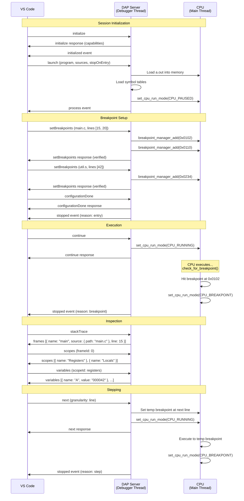

# ND100X DAP Integration Complete Guide

## Table of Contents

1. [Overview](#overview)
2. [Architecture](#architecture)
3. [DAP Message Flow](#dap-message-flow)
4. [Source Code Organization](#source-code-organization)
5. [a.out Loading Process](#aout-loading-process)
6. [Symbol Table Management](#symbol-table-management)
7. [VS Code Extension Integration](#vs-code-extension-integration)
8. [Configuration Examples](#configuration-examples)
9. [Troubleshooting](#troubleshooting)

## Overview

The ND100X emulator implements a complete Debug Adapter Protocol (DAP) server that enables source-level debugging of ND-100 programs in Visual Studio Code and other DAP-compatible IDEs.

**Key Features:**
- Mixed C and assembly debugging
- Source-level stepping
- Breakpoints with conditions and logpoints
- Memory inspection and disassembly
- Register and status flag viewing
- Multi-format symbol table support (MAP, a.out, STABS)

## Architecture

### Dual-Thread Model

```
┌─────────────────────────────────────────────────────────┐
│                   ND100X Process                        │
│                                                         │
│  ┌──────────────────────┐    ┌─────────────────────┐   │
│  │  Main Thread         │    │  Debugger Thread    │   │
│  │                      │    │                     │   │
│  │  ┌────────────────┐  │    │  ┌──────────────┐  │   │
│  │  │ Machine Loop   │  │    │  │ DAP Server   │  │   │
│  │  │  cpu_run()     │  │    │  │  Port 4711   │  │   │
│  │  └────────────────┘  │    │  └──────────────┘  │   │
│  │         │            │    │         │          │   │
│  │         v            │    │         v          │   │
│  │  ┌────────────────┐  │    │  ┌──────────────┐  │   │
│  │  │ CPU Execution  │◄─┼────┼─►│ Command      │  │   │
│  │  │ Breakpoints    │  │    │  │ Handlers     │  │   │
│  │  └────────────────┘  │    │  └──────────────┘  │   │
│  └──────────────────────┘    └─────────────────────┘   │
│                                                         │
│  Atomic Flags: debugger_request_pause,                  │
│                debugger_control_granted,                │
│                cpu_run_mode                            │
└─────────────────────────────────────────────────────────┘
                         ▲
                         │ TCP Socket (DAP Protocol)
                         │
                    ┌────────────┐
                    │  VS Code   │
                    │  Debug UI  │
                    └────────────┘
```

### Thread Coordination

**Pause Flow:**
1. DAP client sends `pause` command → Debugger thread
2. Debugger thread sets `debugger_request_pause = true`
3. CPU checks flag after each instruction
4. CPU sets `cpu_run_mode = CPU_PAUSED`
5. CPU sets `debugger_control_granted = true`
6. Debugger thread sends `stopped` event

**Resume Flow:**
1. DAP client sends `continue` command → Debugger thread
2. Debugger thread sets `cpu_run_mode = CPU_RUNNING`
3. Debugger thread sets `debugger_control_granted = false`
4. CPU resumes execution
5. Debugger thread sends `continued` event

## DAP Message Flow

### Complete Debug Session Example



## Source Code Organization

### DAP Implementation Files

```
src/debugger/
├── debugger.c              # Main DAP implementation (2800+ lines)
│   ├── Thread management   # Lines 84-180
│   ├── Helper functions    # Lines 493-608 (NEW)
│   ├── Command handlers    # Lines 610-2640
│   ├── Server init         # Lines 2642-2734
│   └── Capabilities        # Lines 2772-2802
├── debugger.h              # Public interface
└── symbols_support.h       # Symbol table helpers

src/cpu/
├── cpu.c                   # CPU execution loop
│   ├── cpu_run()          # Lines 524-607 - breakpoint checks
│   └── init_cpu_debugger() # Line 644 - debugger init
└── cpu_bkpt.c             # Breakpoint manager
    ├── Hash table          # Lines 28-65
    └── check_for_breakpoint() # Lines 213-272

external/libdap/            # DAP protocol library
├── libdap/include/
│   ├── dap_server.h       # Server API
│   ├── dap_protocol.h     # Protocol definitions
│   └── dap_server_cmds.h  # Capability enums
└── libdap/src/
    ├── dap_server.c       # Core server
    └── dap_server_cmds.c  # Command handling

external/libsymbols/        # Symbol table library
├── include/
│   ├── aout.h             # a.out format definitions
│   └── symbols.h          # Symbol table API
└── src/
    ├── aout.c             # a.out loader
    └── symbols.c          # Symbol management
```

### Call Flow for Key Operations

#### Breakpoint Hit

```
1. cpu_run()                    (cpu.c:524)
2. private_cpu_tick()           (cpu.c:416)
3. do_op()                      (cpu_mopc.c)
4. check_for_breakpoint()       (cpu_bkpt.c:213)
5. breakpoint_manager_check()   (cpu_bkpt.c:179)
6. set_cpu_run_mode(CPU_BREAKPOINT)
7. return to machine_run()      (machine.c)
8. cmd_check_cpu_events()       (debugger.c:256)
9. dap_server_send_stopped_event()
```

#### Set Breakpoint

```
1. VS Code sends setBreakpoints request
2. dap_server_run()             (dap_server.c)
3. handle_set_breakpoints()     (dap_server_cmds.c)
4. cmd_set_breakpoints()        (debugger.c:1937)
5. symbols_find_address()       (symbols.c)
6. breakpoint_manager_add()     (cpu_bkpt.c:69)
7. Hash table insertion
8. Return verified=true/false
```

#### Stack Trace

```
1. VS Code sends stackTrace request
2. cmd_stack_trace()            (debugger.c:1718)
3. Loop through stack_trace.frames[]
4. symbols_get_line()           (symbols.c)
5. symbols_get_file()           (symbols.c)
6. file_exists()                (debugger.c:514)
7. get_or_create_source_reference() (if needed)
8. Return frames with source info
```

## a.out Loading Process

### File Format

```
Offset  | Content                  | Size
--------|--------------------------|------------------
0       | Header                   | 16 bytes (8 words)
16      | Zero Page (optional)     | a_zp * 2 bytes
...     | Text Segment (code)      | a_text * 2 bytes
...     | Data Segment (init data) | a_data * 2 bytes
...     | Zero Page Relocation     | a_zp * 2 bytes
...     | Text Relocation          | a_text * 2 bytes
...     | Data Relocation          | a_data * 2 bytes
...     | Symbol Table             | a_syms bytes (NOT *2!)
...     | String Table             | Variable
```

### Header Structure

```c
typedef struct {
    uint16_t a_magic;   // 0407 (normal), 0410 (RO text), 0411 (sep I&D)
    uint16_t a_text;    // Text size in WORDS
    uint16_t a_data;    // Data size in WORDS
    uint16_t a_bss;     // BSS size in WORDS
    uint16_t a_syms;    // Symbol table size in BYTES (exception!)
    uint16_t a_entry;   // Entry point address
    uint16_t a_zp;      // Zero page size in WORDS
    uint16_t a_flag;    // Flags
} aout_header_t;
```

**Important:** All sizes are in WORDS except `a_syms` which is in BYTES.

### Loading Sequence

```c:374:465:aout.c
int load_aout(const char *filename, bool verbose, write_memory_callback write_memory)
{
    FILE *f = fopen(filename, "rb");
    
    // 1. Load header
    load_header(f, &header, verbose);
    
    // 2. Skip zero page
    fseek(f, 16 + header.a_zp * 2, SEEK_SET);
    
    // 3. Load text segment (code)
    for (uint16_t i = 0; i < header.a_text; i++) {
        uint16_t word;
        read_word(f, &word);  // Little-endian read
        write_memory(TEXT_START + i, word);
    }
    
    // 4. Load data segment (initialized variables)
    uint16_t data_addr = DATA_START(header.a_text);
    for (uint16_t i = 0; i < header.a_data; i++) {
        uint16_t word;
        read_word(f, &word);
        write_memory(data_addr + i, word);
    }
    
    // 5. Calculate symbol table offset
    long sym_offset = 16 + (header.a_zp * 2) + (header.a_text * 2) + 
                      (header.a_data * 2) + (header.a_zp * 2) + 
                      (header.a_text * 2) + (header.a_data * 2);
    
    // 6. Load symbols
    load_symbols_with_string_table(f, sym_offset, header.a_syms, verbose);
    
    fclose(f);
    return header.a_entry;  // Return entry point
}
```

### Word vs Byte Handling

**ND-100 is word-addressed:**
- Memory addresses are in words (16-bit)
- `a_text`, `a_data`, `a_bss`, `a_zp` are word counts
- File offsets must multiply by 2 to get byte offsets

**Exception:**
- `a_syms` is in bytes (Unix a.out tradition)

### Memory Layout After Loading

```
Address  | Content              | Source
---------|----------------------|------------------
0x0000   | Text segment (code)  | From a_text section
...      | ...                  |
0xNNNN   | Data segment         | From a_data section
...      | BSS (zero-filled)    | Not in file (a_bss)
```

## Symbol Table Management

### Symbol Table Types

The emulator supports three symbol table formats:

1. **MAP Files** - Assembly listing format
   ```
   LABEL1    000100
   LABEL2    000234
   ```

2. **a.out Symbols** - Unix symbol table
   ```
   n_strx | n_type | n_value
   -------|--------|--------
   0x0000 | 0x24   | 0x0100   (N_FUN - function)
   0x0008 | 0x44   | 0x0102   (N_SLINE - line 1)
   ```

3. **STABS** - Symbol table strings (in assembly)
   ```
   .stabs "main.c",N_SO,0,0,0
   .stabs "main:F1",N_FUN,0,15,_main
   .stabn N_SLINE,0,15,0x0100
   ```

### Symbol Lookup Strategy

**For Breakpoints:**
```c
// 1. Try STABS (best for C)
if (symbol_tables.symbol_table_stabs) {
    found = symbols_find_address(stabs_table, source_file, &addr, &diff, line);
}

// 2. Try MAP (best for assembly)
if (!found && symbol_tables.symbol_table_map) {
    found = symbols_find_address(map_table, source_file, &addr, &diff, line);
}

// 3. Try a.out (functions only)
if (!found && symbol_tables.symbol_table_aout) {
    found = symbols_find_address(aout_table, source_file, &addr, &diff, line);
}
```

**For Stack Traces:**
```c
// Same order, but for address → (file, line) mapping
line = symbols_get_line(stabs_table, address);
file = symbols_get_file(stabs_table, address);

if (!line || !file) {
    line = symbols_get_line(map_table, address);
    file = symbols_get_file(map_table, address);
}

if (!line || !file) {
    line = symbols_get_line(aout_table, address);
    file = symbols_get_file(aout_table, address);
}
```

### Symbol Loading on Launch

```c:2056:2300:debugger.c
static int cmd_launch_callback(DAPServer *server)
{
    // 1. Load program binary
    program_load(BOOT_AOUT, program_path, true);
    gPC = STARTADDR;
    
    // 2. Clear old symbols
    free_symbol_table();
    free_source_references();
    
    // 3. Load MAP file (if provided)
    if (map_path) {
        init_symbol_support(map_path, SYMBOL_TYPE_MAP);
    }
    
    // 4. Load symbols from a.out
    if (program_path) {
        init_symbol_support(program_path, SYMBOL_TYPE_AOUT);
    }
    
    // 5. Try to find STABS file (program.s)
    if (program_path) {
        char stabs_path[600];
        snprintf(stabs_path, sizeof(stabs_path), "%s.s", base_name);
        if (file_exists(stabs_path)) {
            init_symbol_support(stabs_path, SYMBOL_TYPE_STABS);
        }
    }
    
    // 6. Build initial stack trace
    debugger_build_stack_trace(gPC, 0);
    
    // 7. Map initial PC to source
    int line = symbols_get_line(symbol_tables.symbol_table_map, gPC);
    const char *file = symbols_get_file(symbol_tables.symbol_table_map, gPC);
    
    // 8. Send events
    dap_server_send_process_event(server, program_path, 1, true, "launch");
    
    if (stop_at_entry) {
        dap_server_send_stopped_event(server, "entry", "Stopped at program entry");
        set_cpu_run_mode(CPU_PAUSED);
    }
    
    return 0;
}
```

## VS Code Extension Integration

### Extension Architecture

```
vscode-nd100-assembly/
├── package.json           # Extension manifest
├── src/
│   ├── extension.ts       # Entry point
│   ├── debugger.ts        # DAP integration
│   └── providers/         # Language features
└── syntaxes/              # Syntax highlighting
```

### Key Components

1. **Debug Configuration Provider**
   - Provides smart defaults for launch configs
   - Validates source files
   - Handles C vs assembly file types

2. **Debug Adapter Descriptor Factory**
   - Spawns nd100x process (if `autoLaunch: true`)
   - Returns TCP server descriptor (port 4711)
   - Manages process lifecycle

3. **Debug Adapter Tracker**
   - Logs DAP messages for debugging
   - Helpful for troubleshooting protocol issues

### Debug Type: "ND-100"

**Important:** Changed from "ND-100 Assembly" to "ND-100" to support both languages.

### Launch Configuration Properties

| Property | Type | Description | Default |
|----------|------|-------------|---------|
| `program` | string | Path to .out file | Required |
| `sources` | array | Source files for debugging | `[]` |
| `mapFile` | string | Path to .map file | Optional |
| `cwd` | string | Working directory | `${workspaceFolder}` |
| `stopOnEntry` | boolean | Stop at entry point | `true` |
| `autoLaunch` | boolean | Auto-spawn nd100x | `true` |
| `port` | number | DAP server port | `4711` |

**Deprecated:**
- `sourceFile` (string) - Use `sources` array instead

## Configuration Examples

### Pure Assembly Project

```json
// .vscode/launch.json
{
    "version": "0.2.0",
    "configurations": [
        {
            "name": "Debug Assembly",
            "type": "ND-100",
            "request": "launch",
            "program": "${workspaceFolder}/program.out",
            "sources": [
                "${workspaceFolder}/main.s",
                "${workspaceFolder}/lib.s"
            ],
            "mapFile": "${workspaceFolder}/program.map",
            "stopOnEntry": true
        }
    ]
}
```

### Mixed C/Assembly Project

```json
// .vscode/launch.json
{
    "version": "0.2.0",
    "configurations": [
        {
            "name": "Debug Mixed Project",
            "type": "ND-100",
            "request": "launch",
            "program": "${workspaceFolder}/a.out",
            "sources": [
                "${workspaceFolder}/main.c",
                "${workspaceFolder}/utils.c",
                "${workspaceFolder}/delay.s",
                "${workspaceFolder}/**/*.h"
            ],
            "stopOnEntry": true,
            "preLaunchTask": "Build Project"
        }
    ]
}
```

### Pure C Project

```json
// .vscode/launch.json
{
    "version": "0.2.0",
    "configurations": [
        {
            "name": "Debug C Program",
            "type": "ND-100",
            "request": "launch",
            "program": "${workspaceFolder}/a.out",
            "sources": [
                "${workspaceFolder}/**/*.c",
                "${workspaceFolder}/**/*.h"
            ],
            "stopOnEntry": true
        }
    ]
}
```

### With Build Task

```json
// .vscode/tasks.json
{
    "version": "2.0.0",
    "tasks": [
        {
            "label": "Build Project",
            "type": "shell",
            "command": "make",
            "args": ["all"],
            "group": {
                "kind": "build",
                "isDefault": true
            },
            "problemMatcher": ["$gcc"]
        }
    ]
}
```

## Troubleshooting

### Breakpoints Not Hitting

**Symptoms:** Breakpoint shows gray circle, never hits

**Causes:**
1. **No symbol table** - Program loaded without debug info
2. **Wrong source path** - File path doesn't match symbol table entry
3. **Line not executable** - Breakpoint on comment/blank line

**Solutions:**
```bash
# Check if symbols loaded
nd100x -b aout -i a.out -v | grep "symbol"

# Verify MAP file generated
ls -l program.map

# Check symbol table in a.out
nm a.out
```

### Source Files Not Found

**Symptoms:** Stack trace shows addresses but no source files

**Causes:**
1. **No MAP or STABS** - No line→address mapping
2. **Wrong file paths** - Symbol table has different paths

**Solutions:**
```bash
# Generate MAP file when assembling
ndasm -m program.map -o program.out main.s

# Compile C with debug info
gcc -g -o a.out main.c

# Check symbol table
objdump -g a.out
```

### Step Over Not Working

**Symptoms:** Step over goes into functions or steps by instruction

**Causes:**
1. **No symbol table** - Can't find next line
2. **Granularity not set** - Defaults to instruction

**Solutions:**
- Ensure MAP file or STABS are loaded
- Check granularity in next request
- Verify `supportsSteppingGranularity` is true

### Debugger Won't Connect

**Symptoms:** "Cannot connect to runtime process" error

**Causes:**
1. **nd100x not running** - Auto-launch failed
2. **Wrong port** - Not listening on 4711
3. **Firewall** - Port blocked

**Solutions:**
```bash
# Check if nd100x is running
ps aux | grep nd100x

# Check if port is listening
netstat -tlnp | grep 4711

# Manually launch debugger
nd100x -d -p=4711 -b aout -i a.out
```

### VS Code Shows "Unknown Debugger Type"

**Symptoms:** Can't start debug session, unknown type error

**Cause:** Extension not installed or not activated

**Solutions:**
1. Install extension from VSIX
2. Reload VS Code window
3. Check activation events in package.json
4. Verify extension is enabled

## Advanced Topics

### Custom Symbol Table Format

If using custom toolchain, implement symbol provider:

```c
bool my_custom_symbol_loader(symbol_table_t *table, const char *filename) {
    // Parse your format
    // Call symbols_add_entry() for each symbol
    return true;
}

// Register in debugger.c
if (custom_format) {
    my_custom_symbol_loader(symbol_tables.symbol_table_custom, filename);
}
```

### Source References for Generated Code

For code generated at runtime or embedded in executable:

```c
// During launch, register sources
for (int i = 0; i < embedded_source_count; i++) {
    int ref = get_or_create_source_reference(embedded_sources[i].name);
    // Cache content
    source_refs[ref].content = strdup(embedded_sources[i].code);
}

// Return in stack frames
frame->source_path = NULL;
frame->source_reference = ref;
```

### Multi-Architecture Support

The DAP implementation is architecture-independent. To port to another CPU:

1. Implement `cpu_run()` with breakpoint checks
2. Implement `breakpoint_manager_*()` functions
3. Implement `ReadVirtualMemory()` / `WriteVirtualMemory()`
4. Implement disassembler `OpToStr()`
5. Implement symbol loader for your binary format
6. Hook up DAP server with callbacks

## Performance Optimization

### Symbol Lookup Caching

Currently, every breakpoint check and stack trace does symbol lookup. Optimize:

```c
// Cache address → (file, line) mappings
typedef struct {
    uint16_t address;
    char *file;
    int line;
} AddressCache;

static AddressCache *address_cache = NULL;
static int cache_size = 0;

// Check cache before symbol table lookup
const char *cached_get_file(uint16_t addr) {
    for (int i = 0; i < cache_size; i++) {
        if (address_cache[i].address == addr) {
            return address_cache[i].file;
        }
    }
    
    // Cache miss - do lookup and cache result
    const char *file = symbols_get_file(symbol_tables.symbol_table_stabs, addr);
    // Add to cache...
    return file;
}
```

### Breakpoint Hash Table

Already optimized with hash table:
- O(1) average lookup time
- Collision chaining for conflicts
- 1024 buckets for good distribution

## Related Documents

- `dap-analysis.md` - Original DAP analysis
- `DAP_IMPLEMENTATION_SUMMARY.md` - Implementation summary
- `DAP_CAPABILITIES_ANALYSIS.md` - Capability audit
- `VSCODE_EXTENSION_UPDATES.md` - VS Code extension guide

## References

- [Debug Adapter Protocol Specification](https://microsoft.github.io/debug-adapter-protocol/specification)
- [STABS Debug Format Documentation](https://sourceware.org/gdb/current/onlinedocs/stabs.html)
- [PDP-11 a.out Format](https://www.retro11.de/ouxr/211bsd/usr/man/cat5/a.out.0.html)

