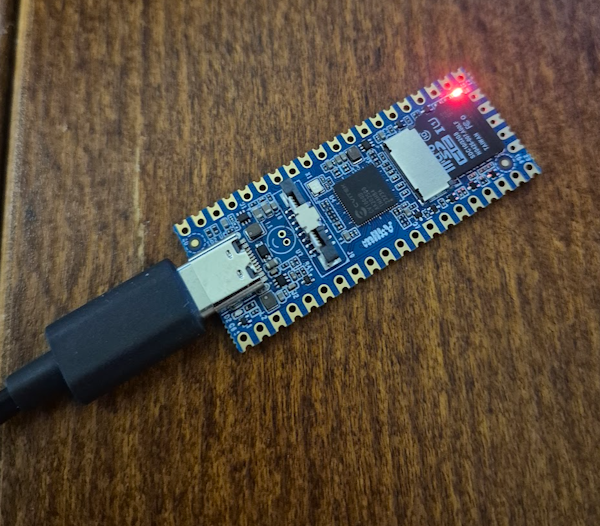
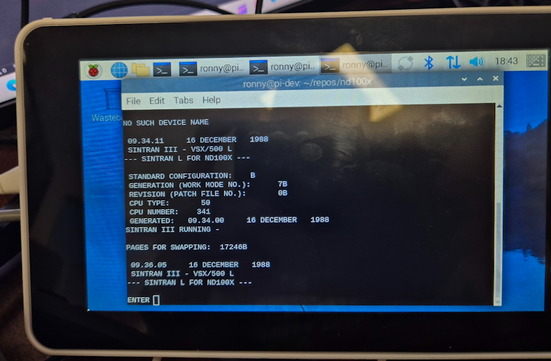
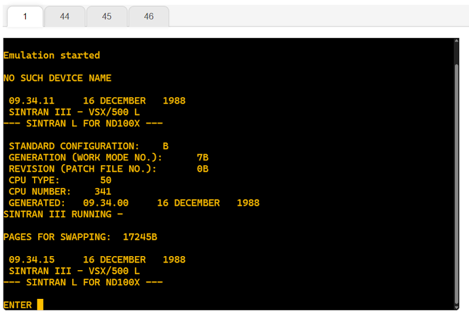

# Tested Systems

This document lists all the systems where nd100x has been tested

## x64 

### Ubuntu 22.04.5 LTS
- **Environment**: Windows Subsystem for Linux (WSL) and Virtual Machine
- **Status**: ✅ Tested and Verified
- **Notes**: 
  - Fully compatible with all features
  - Performance optimized for both WSL and VM environments

## WebAssembly (WASM)

### Browser Environment
- **Type**: Web-based runtime
- **Architecture**: WebAssembly
- **Status**: ✅ Tested and Verified
- **Specifications**:
  - **Runtime**: Browser-based WASM engine
  - **Memory**: Linear memory model
  - **Execution**: Sandboxed environment
- **Notes**:
  - Cross-platform compatibility
  - Secure execution environment
  - Near-native performance
  - Browser-based deployment
- **Links**:
  - [WebAssembly.org](https://webassembly.org/)
  - [MDN WebAssembly Documentation](https://developer.mozilla.org/en-US/docs/WebAssembly)

## RISC-V

### Milk-V Duo
- **Type**: Ultra-compact embedded system
- **Architecture**: RISC-V
- **Status**: ✅ Tested and Verified
- **Specifications**:
  - **SoC**: CVITEK CV1800B
  - **CPU**: Dual-core RISC-V C906 (1GHz + 700MHz)
  - **MCU**: 8051 with 8KB SRAM
  - **Memory**: 64MB SIP DRAM
  - **TPU**: 0.5TOPS@INT8
  - **Storage**: 1x microSD connector or 1x SD NAND on board
  - **USB**: 1x Type-C for power and data, USB Pads available
  - **Camera**: 1x 16P FPC connector (MIPI CSI 2-lane)
  - **Sensor Support**: 4M@25fps
  - **Ethernet**: 100Mbps ethernet with PHY
  - **GPIO**: Up to 26x GPIO Pads
  - **Power**: 5V/1A
  - **OS Support**: Linux, RTOS
  - **Dimensions**: 21mm x 51mm
- **Notes**:
  - Ultra-compact form factor
  - RISC-V architecture support
  - Embedded system capabilities
  - Compatible with Raspberry Pi interfaces
  - Open-source chip data
- **Links**:
  - [Official Website](https://milkv.io/duo)
  - [Documentation](https://milkv.io/docs/duo)

## ARM

### Raspberry Pi 3B
- **Type**: Single-board computer
- **Architecture**: ARM Cortex-A53
- **Status**: ✅ Tested and Verified
- **Specifications**:
  - 1.2GHz quad-core ARM Cortex-A53
  - 1GB RAM
  - 40 GPIO pins
- **Notes**:
  - Excellent for embedded projects
  - Wide community support
  - GPIO interface available
- **Links**:
  - [Official Website](https://www.raspberrypi.com/products/raspberry-pi-3-model-b/)
  - [Documentation](https://www.raspberrypi.com/documentation/)

## System Images

### RISC-V

*Milk-V Duo embedded system*

### ARM

*Raspberry Pi 3B single-board computer*

### WebAssembly

*WebAssembly runtime environment*

---

*Note: This document will be updated as more systems are tested.*
